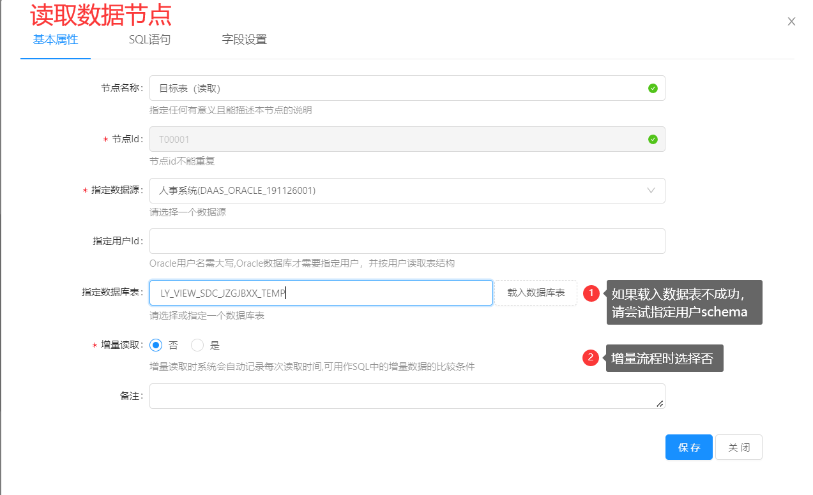

## 一、DTS是什么，有什么用，什么场景用到

DTS指`数据交换服务（Data transfer service）`，是我司与Restcloud公司共同开发的一个数据交换工具。通过DTS，能使用图形化拖拽的方式搭建数据交换流程，定时运行数据交换流程，且能保证源数据库和目标数据库都没有计算压力，不容易造成数据库崩溃。

>  数据交换就是指将某一块数据传输到目标数据容器的技术

## 二、与Restcloud的故事，为什么没有Restcloud公司介绍的功能

该DTS与Restcloud公司只是初版共同开发，后由我司自行二次开发后续版本，所以在合作公司的官网看到的新功能新版本，是几乎不相同的，他们支持的内容我们也无法支持到。

>  由于版本分歧，我方支持项目与restcloud方的支持项目不一致，所以在2020年份，我司已要求restcloud方下架我司支持的项目名单，暂未下架。（联奕公司拥有版权信息）

## 三、怎么搭建数据交换流程，如何搭建流程

请参考该文章下的`《创建数据源》、《创建数据交换流程》、《创建时间调度》、《运行情况监控》`。

[测试](./test.drawio ':include :type=code')

## 四、创建数据源

| 数据源文件类型 | 数据源种类示例            | 支持程度         |
| -------------- | ------------------------- | ---------------- |
| 文件           | EXECL、SQL、TXT           | 完全不支持       |
| API连接        | RestfulAPI、WebsockAPI    | 仅支持用于输出   |
| 主流数据库     | SQLserver、Oracle、Mysql  | 完全支持         |
| 非主流数据库   | 国产、Sybase、Mongo...... | 如有需求联系研发 |
| ...            | ...                       | ...              |

支持的数据库类型如上表所示。

此文仅介绍主流数据库源的创建方式。

### 4.1 选择目标数据库类型文件夹，新增数据源

1. 如果不在目标数据库类型创建，则在导出时找不到对应数据源
2. 如果不点这里，你还能点哪里？
3. 如果不参考命名规则，那维护难度系数剧增1800倍，别问我怎么知道

**长连接的额外配置项**

## 五、创建数据交换流程

### 5.0 创建文件夹、配置底部栏系统信息、新增修改用户、权限管理

从系统右上角处可以找到建立文件夹（菜单项）入口，**其他项**可以参考以下：

<b>系统设置：</b>配置DTS的清日志时间、邮件订阅信息配置、集群配置、底部栏等

#### 界面说明

#### 配置DTS清除日志调度   

- 邮件订阅信息配置    

- 集群功能配置   

#### 系统信息配置  

| 配置项 | 配置名称 | 备注 |
| ------ | -------- | -------- |
|restcloud.masterserver.fixed|指定主服务器|该项确定集群服务器主节点|
|system.config.hidden|隐藏系统设置||
|api.debug|把所有API设置为调试状态||
|allowmixed.requestbody|API为键值对参数时是否允许使用RequestBody提交||
|ConnUtil.listDocsByPage.postgresql|PostgreSQL分页语句| |
|DatabaseProductName|自定义数据库类型产品名||
|ConnUtil.listDocsByPage.hive|Hive数据库的分页SQL||
|repository.html.dir|HTML视图模板代码存放路径||
|repository.type|代码仓库类型(git或者svn)||
|repository.sql.dir|SQL代码仓库存储的路径|                          |
|git.projectdir|GIT仓库本地项目硬盘路径||
|git.password|GIT用户的密码||
|git.username|GIT的用户名||
|git.url|GIT远程仓库URL|                          |
|repository.java.dir|仓库中Java源文件存储目录||
|svn.projectdir|svn项目本地硬盘路径|                          |
|svn.password|svn的密码|                          |
|svn.username|svn的用户名||
|svn.url|SVN远程项目URL|                          |
|AdminIndexUrl|系统登录成功后的首页URL||
|weixin.CorpID|企业微信的企业ID||
|StartClassMonitor|Java源文件扫描监控|                          |
|UrlParameterExtension|服务URI允许的后缀名|                          |
|ConnUtil.listDocsByPage.mysql|MySql的分页SQL语句|                          |
|ConnUtil.listDocsByPage.sqlserver|MSSql分页SQL语句|                          |
|ConnUtil.listDocsByPage.oracle|Oracle分页的SQL语句|                          |
|token.expires.time|Token的有效期小时|                          |
|workflow.engine.host|工作流引擎host地址||
|discovery.server.expirytime|服务实例失效的时间设置||
|token.password|用户加密token的密钥||

<b>用户管理：</b>新增用户、修改用户密码、编辑用户权限、停用锁定用户等

   
<b>菜单管理：</b>编辑系统左边菜单栏的内容，调整位置、新增子文件夹等

### 5.1 创建流程

### 5.2 绘制流程

**注意：**基本按照增量流程模板来，其他模式的流程会导致数据质量平台监控不到（特殊情况也可以使用）

### 5.3  配置流程节点

增量节点删除数据选项对比：

| 删除策略     | 功能点                                                       |
| ------------ | ------------------------------------------------------------ |
| 计算并删除   | 标记插入、更新、删除数据，会实际删除数据使目标表与源头表完全一致 |
| 不计算       | 标记插入、更新数据，不会删除数据，会遗留历史数据下来         |
| 标记且不删除 | 标记插入、更新、删除数据，但仅标记，会将标记状态写入到指定的数据列中 |

## 六、命名规则、命名规范

### 6.1 流程：

目录命名要求：(上行)业务系统名/(下行)目标系统名

> 目录命名例子：人事系统

流程命名要求：源系统->目标系统 @ 目标表中文名 目标表英文名

> 流程命名例子：人事->图书馆 @ 教职工基本信息 RS_JZGJBXX

### 6.2 数据源：

属于数据中心的：全局\_系统名称\_具体用户英文名

不属于数据中心：业务\_系统名称\_具体用户英文名

> 例子：业务\_图书馆\_sa  (中文不需要带”系统”字眼）

## 七、DTS优化之路、DTS好卡解决方案、跑得慢解决方案

### 7.1 配置优化

写在题头，所有的慢、卡都可以通过提升配置解决，但是提升配置能解决的是有极限的，
核心也需要达到64核才能调动到128g以上的内存，所以请酌情添加服务器配置。

> 极限指的是单服务器机最高能接受到200g的内存升级，超过200g内存，就会出现超宽带的情况，反而更慢的情况

### 7.2 字段类型不一致

包括两读取节点和写入节点的字段配置，检查字段类型是否含有数字类型(tinyint, number)，长字段类型(clob, longtext)，出现这些字段后注意能否转成varchar，如果能不能，就尽量两边类型一致

> ORACLE与MYSQL数据类型不完全一致，编码方式也有部分区别

### 7.3 避免大数据量全量交换

数据量过大时读取花费时间过大，可以尝试通过时间戳限制数据更新范围，减少DTS压力。

检查Timestamps等自更新时间字段是否没有取消数据对比，这会让流程每次都全量，失去增量的意义。

检查是否存在null时缺省值，如果有，则清除，通过物理表原有约束完成这种操作，否则容易出现全量交换。

### 7.4 避免出现失败数据

失败数据发现就原地解决，不要拖着，否则日志膨胀量会很夸张，而且失败数据很影响交换速度。

发现流程超过30分钟以上的就要考虑注意下是否有错误数据了

> 若有失败数据，原逐条交换*（目前已被改成合并批量相同逻辑）会从5000一块数据推送拆分成一条一条推送，效率会骤然下降

### 7.5 超时超量数据

超时常见于大数据流程，也出现在调度过快的流程，如果流程还没交换完就推送到下一个节点，DTS有几率会卡死崩溃。建议流程交换间隔不要短于2小时内。

### 避免出现交换高峰

将流程交换分散开，DTS是根据cron表达式准时启动，不会随流程过多往后推移部分流程。意思是同一调度很容易出现高峰，尽量将调度时间分散开，建议每个时间点不要出现高峰，特别是大数据流程，很吃内存。

**关于批量插入调度时间，本人写了一份批量插入时间的脚本，请参考附件中的文件：**`将日期调度批量插入到DTS平台（mongo数据库）v3.js`

> 内存计算：100w数据交换需要10G内存

## 八、常见问题、FQA、异常报错处理

### 8.0 出错了，我要怎么看报错？报错信息在哪里显示？

我们能获取到的报错大致可以从三个入口获取

交换失败记录：流程运行结束后在写入节点双击可查看，通常是ORA-XXXX异常，可通过百度查询解决办法。

流程调试日志：流程还未到写入节点就报错，或者想看能关联到流程的信息，都可以从这个入口找到信息。

控制台日志：终极手段，DTS全平台产生的日志，如果上面都排查不出来就可以找找这里了，

> 推荐玩法：开俩窗口，1窗是日志，2窗是报错界面。先清空日志，去2窗将报错操作复现一遍，回来1窗立马刷新日志，就能看到最新的报错（一般在顶部）

抱着刨根问底的态度：有没有一种可能，连DTS都没起来。（那你估计得查catalina.out看报错了，此处超纲了)

### 8.1 载入数据库无法读取表，读取表为0个

尝试在数据源配置中加入用户Schema的配置，使其为指定数据库名称，再尝试

### 8.2 如何优化DTS、DTS跑得慢、DTS好卡

↑参考[《七、DTS优化之路》](#七、dts优化之路、dts好卡解决方案、跑得慢解决方案)章节

### 8.3 交换过去的数据会出现重复数据

主键配置问题，请将唯一主键确定，并且确认写入和增量节点是否一致，然后清表重推

### 8.4 必须先保存流程或者本节点的前继路由线才可以读取字段配置!

那就先保存流程和读取节点点进去保存一下咯(狗头)

### 8.5 流程监控中流程一直卡在写入节点上

检测目标表是否包含触发器，如果存在触发器，则联系负责该业务系统的相关人员(常见于学工系统、事务中心)

### 8.6 提示删除失败  

检测数据库当前权限是否已包含delete

### 8.7 数据每次同步出现全量更新  

检测目标表字段类型是否与源表类型匹配，常见于Oracle与mysql上的对比

> 如mysql中的tinyint在Oracle中是没这个类型的，需要在字段设置中把tinyint修改为int类型再进行对比

### 8.8 怎么添加新用户，如何增加用户，想给老师加账号，新建账号，修改密码

↑参考[《5.0 创建文件夹、配置底部栏系统信息、新增修改用户、权限管理》](#_50-创建文件夹、配置底部栏系统信息、新增修改用户、权限管理)章节

### 8.9 我的SQL能在编辑器执行，但是DTS无法分析字段/执行/预览，错误：无效字符

如果SQL末尾添加了分号，请删除，这个分号会影响SQL解析。

### 8.10 修改admin密码时提示原密码不得少于8位。

这属于迷惑问题，但是现场遇到就记录下来。

这里我通过数据库可以修改到admin密码，因为已加密，可以通过系统新增一个用户，将新用户的密码覆盖掉admin的密码，以此完成修改密码的操作。

或者可以新建一位超级管理员用户，将原admin账户删除，毕竟admin是一个敏感用户名，容易被猜到，不安全。

### 8.11 数据库密码修改、数据库连接修改，数据库迁移应该修改哪个文档。

1. 找到DTS安装目录，一般可以通过进程位置找到。
2. 通过修改DTS的配置文档application.properties完成的数据库迁移

### 8.12 sql分析不了，无法通过sql分析获取表结构，点了报错

情况一般分为两种：

如果是`sql不正确`，请去数据库手动执行该SQL。如果手动执行能成功的情况，参考篇章：[8.9 我的SQL能在编辑器执行，但是DTS无法分析字段/执行/预览，错误：无效字符](#_89-我的SQL能在编辑器执行，但是DTS无法分析字段执行预览，错误：无效字符)

如果是`数据表为空`，请通过的从表中读入，如果非要通过SQL读入，可以手动插入一条数据到数据表，就能通过SQL读入了。

> SQL分析时，DTS会先执行一次检索数据量的sql，再通过这个数据量决定要循环次数，但是这个检索数据量的sql在表为空时会报错。

### 8.13 载入数据库表后DTS反应一段时间后出现加载的表数量，然后DTS就无法操作

可能是DTS加载的表数量太大，可从出现加载的表数量判断，这种情况只是页面卡死，并非DTS服务宕机

处理方案：重新打开一个页面，不再载入数据库表，直接在SQL语句上写上需要的SQL，字段设置点击从SQL中分析（此处分析可能不准，需人工校准），其他设置照常即可

### 8.14 DTS存在个别字段数据没有推送成功且没有传输失败信息

1. 检查增量节点中，源表字段与目标表字段是否匹配
2. 源表预览数据时检查字段数据能否正确读取，格式是否正确（常见场景为时间格式不统一，导致无法在DTS中正确读取，然后数据推送没有传输失败信息，但数据无法写入目标表）

###  8.99 Service run exception, please contact the administrator to get the detailed log

只要报错都会出现这段英文，代表某处地方出问题了，看`系统监控->控制台日志`找报错原因，然后找百度，如果百度不出来找我。

对于一些新型未见过的写入报错，可以尝试在数据库中手动Insert此数据，如果数据库中也无法将此数据进行Insert则代表此数据存在问题。如果手工Insert可写入，可以通过事务中心提交BUG反馈

如果查到的错误带有`ORA-XXXXX`，请参考百度结果改正SQL，此处仅说明部分常见错误：

| 错误代码/错误信息                                           | 解决方案                                                     |
| ----------------------------------------------------------- | ------------------------------------------------------------ |
| ORA-12537 TNS:connection closed连接关闭 错误信息:关闭的连接 | 增加数据库允许的空闲连接时间，或在数据源配置中配置连接池     |
| ORA-01861: 文字与格式字符串不匹配                           | 通常在to_date或者to_char或者to_clob等转换上容易出现的问题，需检查原表中是否包含"脏数据" 使用工具进行SQL查询时一般是默认返回100或者1000行的数据，检验是否为原数据问题，在工具内把全部数据加载出来，中途可能会遇到报错的条目，把报错的条目过滤或者清洗即可 |
| ORA-00904：标示符无效                                       | 列名写错了，和数据表中的列名不一致，中文列名没带引号         |
| ORA-00911:invalid character                                 | 检测SQL语句的标点符号，以及是否包含关键字，包含关键字的需要加引号处理 |
| ORA-01840: 输入值对于日期格式不够长                         | 该错误常见于char转date类型。如：原表中可能包含了"2019-02-29"或"19年-01-01"或者其他不符合日期逻辑或错误的日期，在进行to_date转换时容易出现此问题，需要先检查数据源中的日期是否均符合日期转换标准，再进行转换，如果不符合标准，需要手工转换，或者过滤掉即可 |
| ORA-00001: 违反唯一约束条件                                 | 通常出现在原表没有条件约束，传输至含有主键的目标表。需检测原表是否此字段是否包含重复数据，或增加目标表的主键字段，使此条数据可被作为唯一标识 |
| ORA-00604：超出打开游标最大数                               | 增大数据库的游标值，或使用连接池并限制提交数据量(在写入目标表步骤中的提交数据上限制，如：填入100) |
| ORA-12899：value too large for column                       | 字段长度不一致，常见于数据库双方编码不匹配。需要增加字段长度。如char类型的汉字GBK,GB2312类型每个字符在数据库中只占用2个长度单位，如果把该字段传入UTF-8的数据库内则会占用3个长度单位，此时需要把UTF8的目标字段长度增加至可容纳的长度大小即可 |

