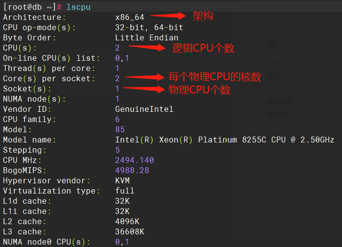
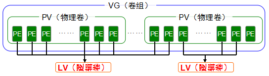

## linux常见资源检查
### CPU

**查看CPU信息**

```bash
cat /proc/cpuinfo
lscpu
```

**CPU信息的获取**

```bash
#查看物理CPU个数
cat /proc/cpuinfo| grep "physical id"| sort| uniq| wc -l
#查看物理核数
cat /proc/cpuinfo | grep "cpu cores" | wc -l
#查看逻辑核数（通过超线程技术，能将一个物理核分成多个逻辑核）
cat /proc/cpuinfo| grep "processor"| wc -l
#查看物理CPU型号
cat /proc/cpuinfo | grep name | cut -f2 -d: | sort | uniq
#查看服务器型号
dmidecode | grep "Product Name"
```



**查看CPU使用情况**

```bash
top
```

一般查看右上角的 load  average，该项有三个值，如：0.01,0.04,0.05  分别表示最近一分钟平均负载、最近5分钟平均负载、最近10分钟 平均负载。一般对于 16核 的操作系统，当 load average 值超过16即意味着负载已经很高了，此时需查看是否存在异常进程在消耗CPU资源。

**查看进程占用CPU最高的前10个进程**

```bash
ps aux|head -1;ps aux|grep -v PID|sort -rn -k +3|head
```

### 内存

**查看内存信息**

```
cat /proc/meminfo
```

**查看内存使用情况**

```bash
free -h
```

说明：

- total 是总内存数；
- used 是已经使用的内存数；
- free 是空闲的内存数；
- shared 是多个进程共享的内存总数；
- buffers 是缓冲内存数；
- cached 是缓存内存数；
- available 应用程序认为可用内存数，available = free + buffer + cache (注：只是大概的计算方法)

一般查看available可用内存数，如果该数值很低，需查看是否存在异常进程在消耗内存资源。

查看进程占用内存最高的前10个进程

```bash
ps aux|head -1;ps aux|grep -v PID|sort -rn -k +3|head
```

### IO

**查看IO使用情况**

```bash
iostat -xm 1
```

说明：

- %user：CPU处在用户模式下的时间百分比。
- %nice：CPU处在带NICE值的用户模式下的时间百分比。
- %system：CPU处在系统模式下的时间百分比。
- %iowait：CPU等待输入输出完成时间的百分比。如果%iowait的值过高，表示硬盘存在I/O瓶颈。
- %steal：管理程序维护另一个虚拟处理器时，虚拟CPU的无意识等待时间百分比。
- %idle：CPU空闲时间百分比。

### 磁盘空间

**查看磁盘使用情况**

```bash
df -h
```

若查看已用达到 90% 以上，此时就需要查看是否有能清理的文件，可清理的文件一般为日志文件、临时文件等。

### 进程/端口

**查看进程**

```bash
ps aux
ps -eo user,pid,ppid,pcpu,pmem,tty,lstart,etime,command
```

**强制杀进程**

```bash
kill -9 <进程号>
```

**查看端口使用情况**

```bash
netstat -ntupl
ss -ntupl
```

**查看端口被谁占用**

```bash
lsof -i:1521
```

**查看文件被谁占用**

```bash
lsof /usr/local/nginx/logs/access.log
```

**查看目录被谁占用**

```bash
lsof +D /home
```

### IP

**查看ip**

```bash
ifconfig -a
ip addr show
```

**查看网关**

```bash
route -n
ip route show
```

### 日志

**系统常用的日志**

|日志文件|说明|
|-|-|
|/var/log/boot.log|系统启动日志|
|/var/log/cron|记录系统定时任务相关的日志|
|/var/log/cups/|记录打印信息的日志|
|/var/log/dmesg|记录了系统在开机时内核自检的信息。也可以使用dmesg命令直接查看内核自检信息|
|/var/log/btmp|记录错误登录的日志。这个文件是二进制，不能直接用vi查看，而要使用lastb命令查看|
|/var/log/lastlog|记录系统中所有用户最后一次的登录时间的日志。这个文件也是二进制文件，要使用lastlog命令查看|
|/var/log/mailog|记录邮件信息的日志|
|/var/log/messages|记录系统重要信息的日志，这个日志文件中会记录Linux系统的绝大多数重要信息。如果系统出现问题，首先要检查的应该就算这个日志文件|
|/var/log/secure|记录验证和授权方面的信息，只要涉及账户和密码的程序都会记录，比如系统的登录、ssh的登录、su切换用户，sudo授权，甚至添加用户和修改用户密码都会记录在这个日志中|
|/var/log/wtmp|永久记录所有用户的登录、注销信息，同时记录系统的启动、重启、关机事件。是二进制文件，而要使用last命令查看|
|/var/tun/ulmp|记录当前已登录的用户的信息。这个文件会随着用户的登录和注销而不断变化，只记录当前登录用户的信息。这个文件不能用vi查看，而是使用w、who、users等命令查看|

### sshd

openssh相关日志：/var/log/secure

openssh IP登录限制：/etc/hosts.allow和/etc/hosts.deny。（官方6.7版本后已不支持，需[#openssh ip登录限制|通过sshd_config进行IP登录限制](#sshd)。）
## 磁盘清理
利用 `du -sh` 统计指定目录大小，使用 `sort -h` 进行排序

```bash
#统计指定目录大小
du -sh /oracle | sort -h

#统计指定目录下所有目录大小（不包括子目录）
du -sh /* | sort -h
du -sh /oracle/* | sort -h
```

利用 `du -h` 统计指定目录下所有目录的大小，使用 `sort -h` 进行排序

```bash
du -h / | sort -h
du -h /oracle | sort -h
```

根据目录大小，检查对应目录，确认是否是可删除文件，对可删除文件进行清理。

## Oracle目录清理
对于数据库来说，常见的可能比较大的目录以及清理方法：

```bash
#切换到oracle用户
su - oracle

#清理监听日志
cd $ORACLE_BASE/diag/tnslsnr/$HOSTNAME/listener/trace
echo > listener.log
cd $ORACLE_BASE/diag/tnslsnr/$HOSTNAME/listener/alert
rm -f log_*xml

#清理实例日志
cd $ORACLE_BASE/diag/rdbms/orcl/orcl/trace
rm -f *trc *trm alert_orcl.log

#清理审计日志
cd $ORACLE_BASE/admin/orcl/adump
rm -f *aud
```

PS：清理归档日志参考[#归档清理|归档清理](#归档清理)文档。
## LVM介绍
### LVM基本概念

**PV：物理卷**

在逻辑卷管理系统的最底层，可为整个物理硬盘或实际物理硬盘上的分区。

**VG：卷组**

建立在物理卷上，一个卷组中至少要包括一个物理卷，卷组建立后可动态的添加物理卷到卷组中。

**LV：逻辑卷**

建立在卷组基础上，卷组中未分配空间可用于建立新的逻辑卷，逻辑卷建立后可以动态扩展和缩小空间。

**PE：物理区域**

物理卷中可用于分配的最小存储单元，物理区域大小在建立卷组时指定，默认是4M，一旦确定不能更改，同一卷组所有物理卷的物理区域大小需一致，新的pv加入到vg后，pe的大小自动更改为vg中定义的pe大小。



### LVM管理命令

|功能|物理卷管理|卷组管理|逻辑卷管理|
|-|-|-|-|
|Scan 扫描|pvscan|vgscan|lvscan|
|Create 创建|pvcreate|vgcreate|lvcreate|
|Display 显示|pvdisplay/pvs|vgdisplay/vgs|lvdisplay/lvs|
|Remove 删除|pvremove|vgremove|lvremove|
|Extend 扩展||vgextend|lvextend|
|Reduce 减少||vgreduce|lvreduce|

### LVM的创建

##### 1.创建物理卷

查看磁盘分区

```bash
[root@db ~]# fdisk -l /dev/sdb

磁盘 /dev/sdb：10.7 GB, 10737418240 字节，20971520 个扇区
Units = 扇区 of 1 * 512 = 512 bytes
扇区大小(逻辑/物理)：512 字节 / 512 字节
I/O 大小(最小/最佳)：512 字节 / 512 字节
```

对磁盘进行分区

```bash
[root@db ~]# fdisk /dev/sdb
欢迎使用 fdisk (util-linux 2.23.2)。

更改将停留在内存中，直到您决定将更改写入磁盘。
使用写入命令前请三思。

Device does not contain a recognized partition table
使用磁盘标识符 0x287e3efc 创建新的 DOS 磁盘标签。

命令(输入 m 获取帮助)：n
Partition type:
   p   primary (0 primary, 0 extended, 4 free)
   e   extended
Select (default p): p
分区号 (1-4，默认 1)：
起始 扇区 (2048-20971519，默认为 2048)：
将使用默认值 2048
Last 扇区, +扇区 or +size{K,M,G} (2048-20971519，默认为 20971519)：
将使用默认值 20971519
分区 1 已设置为 Linux 类型，大小设为 10 GiB

命令(输入 m 获取帮助)：p

磁盘 /dev/sdb：10.7 GB, 10737418240 字节，20971520 个扇区
Units = 扇区 of 1 * 512 = 512 bytes
扇区大小(逻辑/物理)：512 字节 / 512 字节
I/O 大小(最小/最佳)：512 字节 / 512 字节
磁盘标签类型：dos
磁盘标识符：0x287e3efc

   设备 Boot      Start         End      Blocks   Id  System
/dev/sdb1            2048    20971519    10484736   83  Linux

命令(输入 m 获取帮助)：w
The partition table has been altered!

Calling ioctl() to re-read partition table.
正在同步磁盘。
[root@db ~]# fdisk -l /dev/sdb

磁盘 /dev/sdb：10.7 GB, 10737418240 字节，20971520 个扇区
Units = 扇区 of 1 * 512 = 512 bytes
扇区大小(逻辑/物理)：512 字节 / 512 字节
I/O 大小(最小/最佳)：512 字节 / 512 字节
磁盘标签类型：dos
磁盘标识符：0x287e3efc

   设备 Boot      Start         End      Blocks   Id  System
/dev/sdb1            2048    20971519    10484736   83  Linux
```

fdisk命令参数说明：

- b 编辑bsd磁盘标签
- c 切换dos兼容性标志
- d 删除分区
- g 创建一个新的空GPT分区表
- G 创建一个IRIX（SGI）分区表
- I 列出已知的分区类型
- m 打印菜单
- n 添加一个新分区
- o 创建一个新的空DOS分区表
- p 打印分区表
- q 在不保存更改的情况下退出
- s 创建一个新的空Sun磁盘标签
- t 不要更改分区的系统id
- u 更改显示/输入单位
- v 验证分区表
- w 将表写入磁盘并退出
- x 额外功能（仅限专家）

创建物理卷

```bash
[root@db ~]# pvcreate /dev/sdb1
  Physical volume "/dev/sdb1" successfully created.
```

查看物理卷信息

```bash
[root@db ~]# pvdisplay  /dev/sdb1
  "/dev/sdb1" is a new physical volume of "<10.00 GiB"
  --- NEW Physical volume ---
  PV Name               /dev/sdb1
  VG Name               
  PV Size               <10.00 GiB
  Allocatable           NO
  PE Size               0   
  Total PE              0
  Free PE               0
  Allocated PE          0
  PV UUID               fYqMaw-CFOa-VYfW-8IQu-BuDG-Dp8l-e24ymc
   
[root@db ~]# pvs /dev/sdb1
  PV         VG Fmt  Attr PSize   PFree  
  /dev/sdb1     lvm2 ---  <10.00g <10.00g
```

##### 2.创建卷组

创建卷组

```bash
[root@db ~]# vgcreate data /dev/sdb1
  Volume group "data" successfully created
#这里的data表示卷组的名称
```

查看卷组信息

```bash
[root@db ~]# vgdisplay data
  --- Volume group ---
  VG Name               data
  System ID             
  Format                lvm2
  Metadata Areas        1
  Metadata Sequence No  1
  VG Access             read/write
  VG Status             resizable
  MAX LV                0
  Cur LV                0
  Open LV               0
  Max PV                0
  Cur PV                1
  Act PV                1
  VG Size               <10.00 GiB
  PE Size               4.00 MiB
  Total PE              2559
  Alloc PE / Size       0 / 0   
  Free  PE / Size       2559 / <10.00 GiB
  VG UUID               tziabb-ELAe-fIfX-O9WP-Xo7I-gDaB-VFoKcM
   
[root@db ~]# vgs data
  VG   #PV #LV #SN Attr   VSize   VFree  
  data   1   0   0 wz--n- <10.00g <10.00g
#Free  PE / Size和VFree表示剩余空间大小
```

##### 3.创建逻辑卷

```bash
#创建指定大小的逻辑卷
[root@db ~]# lvcreate -L 2G -n data01 data
  Logical volume "data01" created.

#若选择将卷组中的所有剩余空间都给逻辑卷，用以下命令
lvcreate -l 100%FREE -n data01 data
```

lvcreate参数说明：

- -L：指定逻辑卷大小，如 `-L 1G`。单位有bBsSkKmMgGtTpPeE
- -l：使用LE个数来指定逻辑卷大小，如 `-l 200`。LE是就是PE，PE是卷组中的叫法，LE是逻辑卷中的叫法。还有一种是直接使用剩余空间的百分比的形式来给定大小，如 `-l +100%FREE`
- -n：指定逻辑卷名称，如 `-n data01`

查看逻辑卷信息

```bash
[root@db ~]# lvdisplay /dev/data/data01
  --- Logical volume ---
  LV Path                /dev/data/data01
  LV Name                data01
  VG Name                data
  LV UUID                h8jOUK-C8w3-f7xc-bVUd-Rele-CSTj-eXqyU4
  LV Write Access        read/write
  LV Creation host, time db, 2023-01-08 10:45:33 +0800
  LV Status              available
  ### open                 0
  LV Size                2.00 GiB
  Current LE             512
  Segments               1
  Allocation             inherit
  Read ahead sectors     auto
  - currently set to     8192
  Block device           253:2
   
[root@db ~]# lvs /dev/data/data01
  LV     VG   Attr       LSize Pool Origin Data%  Meta%  Move Log Cpy%Sync Convert
  data01 data -wi-a----- 2.00g 
```

### LVM的使用

##### 1.格式化

```bash
#格式化为ext4
[root@db ~]# mkfs.ext4 /dev/data/data01
mke2fs 1.42.9 (28-Dec-2013)
文件系统标签=
OS type: Linux
块大小=4096 (log=2)
分块大小=4096 (log=2)
Stride=0 blocks, Stripe width=0 blocks
131072 inodes, 524288 blocks
26214 blocks (5.00%) reserved for the super user
第一个数据块=0
Maximum filesystem blocks=536870912
16 block groups
32768 blocks per group, 32768 fragments per group
8192 inodes per group
Superblock backups stored on blocks: 
        32768, 98304, 163840, 229376, 294912

Allocating group tables: 完成                            
正在写入inode表: 完成                            
Creating journal (16384 blocks): 完成
Writing superblocks and filesystem accounting information: 完成 

#也可以格式化为xfs
mkfs.xfs /dev/data/data01
```

查看磁盘信息

```bash
[root@db ~]# lsblk -f /dev/sdb
NAME            FSTYPE      LABEL UUID                                   MOUNTPOINT
sdb                                                                      
└─sdb1          LVM2_member       fYqMaw-CFOa-VYfW-8IQu-BuDG-Dp8l-e24ymc 
  └─data-data01 ext4              a30525ad-b0f4-4751-bdcc-e02053444f6a 
```

##### 2.挂载逻辑卷

创建挂载目录

```bash
[root@db ~]# mkdir /data
```

挂载逻辑卷

```bash
[root@db ~]# mount /dev/data/data01 /data
```

查看挂载情况

```bash
[root@db ~]# df -h /data
文件系统                 容量  已用  可用 已用% 挂载点
/dev/mapper/data-data01  2.0G  6.0M  1.8G    1% /data
```

设置开机自动挂载

```bash
[root@db ~]# vi /etc/fstab
/dev/mapper/data-data01 /data ext4     defaults        0 0
```

### LVM的扩容

lvextend 命令用于逻辑卷在线扩容。lvextend 命令参数说明：

- -l：指定逻辑卷的LE个数，如 `-l +200`。还有一种是直接使用剩余空间的百分比的形式来给定大小，如 `-l +100%FREE`
- -L：表示增加多少空间，如 `-L +15G` 。单位有bBsSkKmMgGtTpPeE

扩容时先判断逻辑卷所在卷组是否有剩余空间可用，当有剩余空间时可以直接使用这部分空间，没有的情况下要添加新的磁盘，创建物理卷添加到卷组中，再进行扩容。

查看当前卷组剩余空间大小（这里可以看到有8g可用）

```bash
[root@db ~]# vgs data
  VG   #PV #LV #SN Attr   VSize   VFree 
  data   1   1   0 wz--n- <10.00g <8.00g
```

###### 当卷组有剩余空间可用时

扩容

```bash
#增加3G的空间
[root@db ~]# lvextend -L +3G /dev/data/data01
  Size of logical volume data/data01 changed from 2.00 GiB (512 extents) to 5.00 GiB (1280 extents).
  Logical volume data/data01 successfully resized.

#若选择将卷组中的所有剩余空间都给逻辑卷，用以下命令
lvextend -l +100%FREE /dev/data/data01
```

调整文件系统大小

```bash
#当文件系统是ext4时，执行以下命令
[root@db ~]# resize2fs /dev/data/data01 
resize2fs 1.42.9 (28-Dec-2013)
Filesystem at /dev/data/data01 is mounted on /data; on-line resizing required
old_desc_blocks = 1, new_desc_blocks = 1
The filesystem on /dev/data/data01 is now 1310720 blocks long.

#当文件系统时xfs时，执行以下命令
xfs_growfs /dev/data/data01
```

###### 当卷组没有剩余空间可用时

新增磁盘

```bash
[root@db ~]# fdisk -l /dev/sdc

磁盘 /dev/sdc：10.7 GB, 10737418240 字节，20971520 个扇区
Units = 扇区 of 1 * 512 = 512 bytes
扇区大小(逻辑/物理)：512 字节 / 512 字节
I/O 大小(最小/最佳)：512 字节 / 512 字节
```

分区

```bash
[root@db ~]# fdisk /dev/sdc
欢迎使用 fdisk (util-linux 2.23.2)。

更改将停留在内存中，直到您决定将更改写入磁盘。
使用写入命令前请三思。

Device does not contain a recognized partition table
使用磁盘标识符 0x20e0503a 创建新的 DOS 磁盘标签。

命令(输入 m 获取帮助)：n
Partition type:
   p   primary (0 primary, 0 extended, 4 free)
   e   extended
Select (default p): p
分区号 (1-4，默认 1)：
起始 扇区 (2048-20971519，默认为 2048)：
将使用默认值 2048
Last 扇区, +扇区 or +size{K,M,G} (2048-20971519，默认为 20971519)：
将使用默认值 20971519
分区 1 已设置为 Linux 类型，大小设为 10 GiB

命令(输入 m 获取帮助)：p

磁盘 /dev/sdc：10.7 GB, 10737418240 字节，20971520 个扇区
Units = 扇区 of 1 * 512 = 512 bytes
扇区大小(逻辑/物理)：512 字节 / 512 字节
I/O 大小(最小/最佳)：512 字节 / 512 字节
磁盘标签类型：dos
磁盘标识符：0x20e0503a

   设备 Boot      Start         End      Blocks   Id  System
/dev/sdc1            2048    20971519    10484736   83  Linux

命令(输入 m 获取帮助)：w
The partition table has been altered!

Calling ioctl() to re-read partition table.
正在同步磁盘。
[root@db ~]# fdisk -l /dev/sdc

磁盘 /dev/sdc：10.7 GB, 10737418240 字节，20971520 个扇区
Units = 扇区 of 1 * 512 = 512 bytes
扇区大小(逻辑/物理)：512 字节 / 512 字节
I/O 大小(最小/最佳)：512 字节 / 512 字节
磁盘标签类型：dos
磁盘标识符：0x20e0503a

   设备 Boot      Start         End      Blocks   Id  System
/dev/sdc1            2048    20971519    10484736   83  Linux
```

创建物理卷

```bash
[root@db ~]# pvcreate /dev/sdc1
  Physical volume "/dev/sdc1" successfully created.
```

添加到卷组

```bash
[root@db ~]# vgextend data /dev/sdc1
  Volume group "data" successfully extended
```

此时新加的磁盘空间已加入到卷组，按照[#lvm#当卷组有剩余空间可用时|卷组有剩余空间可用的操作步骤](#当卷组有剩余空间可用时)进行扩容操作。

### LVM的移除

##### 移除逻辑卷

卸载逻辑卷

```bash
[root@db ~]# df -h /data
文件系统                 容量  已用  可用 已用% 挂载点
/dev/mapper/data-data01  4.9G  8.0M  4.7G    1% /data
[root@db ~]# umount /dev/mapper/data-data01
```

移除逻辑卷

```bash
[root@db ~]# lvs
  LV     VG     Attr       LSize   Pool Origin Data%  Meta%  Move Log Cpy%Sync Convert
...
  data01 data   -wi-a-----   5.00g   
[root@db ~]# lvremove /dev/mapper/data-data01
Do you really want to remove active logical volume data/data01? [y/n]: y
  Logical volume "data01" successfully removed
```

##### 移除卷组

需要保证卷组中的所有逻辑卷都已移除

```bash
[root@db ~]# vgs
  VG     #PV #LV #SN Attr   VSize    VFree  
...
  data     1   0   0 wz--n-  <10.00g <10.00g
[root@db ~]# vgremove data
  Volume group "data" successfully removed
```

##### 移除物理卷

需要保证要删除的物理卷已不属于任何卷组

```bash
[root@db ~]# pvs
  PV         VG     Fmt  Attr PSize    PFree  
...
  /dev/sdb1         lvm2 ---   <10.00g <10.00g
  /dev/sdc1         lvm2 ---   <10.00g <10.00g
#VG列为空说明该物理卷没有加入到任何卷组
[root@db ~]# pvremove /dev/sdb1
  Labels on physical volume "/dev/sdb1" successfully wiped.
```

### 其他

添加磁盘后在服务器上查不到，可执行以下命令扫描磁盘

```bash
#查找系统中所有的主机总线编号
[root@db ~]# ls /sys/class/scsi_host
host0  host1  host2
[root@db ~]# ls /sys/class/fc_host
得到主机总线编号后，进行全部扫描
[root@db ~]# echo "- - -" > /sys/class/scsi_host/host0/scan
[root@db ~]# echo "- - -" > /sys/class/scsi_host/host1/scan
[root@db ~]# echo "- - -" > /sys/class/scsi_host/host2/scan
```


## linux lvm磁盘扩容案例
查看当前磁盘使用情况

```Bash
[root@localhost /]# df -h
文件系统                 容量  已用  可用 已用% 挂载点
devtmpfs                  16G     0   16G    0% /dev
tmpfs                     16G     0   16G    0% /dev/shm
tmpfs                     16G  8.8M   16G    1% /run
tmpfs                     16G     0   16G    0% /sys/fs/cgroup
/dev/mapper/centos-root  297G  297G  543M  100% /
/dev/sda1               1014M  149M  866M   15% /boot
tmpfs                    3.2G     0  3.2G    0% /run/user/0
```

根分区已满，需要对磁盘进行扩容，新增了一个磁盘sdb。

我们这里要扩容的逻辑卷是root，卷组是centos（从/dev/mapper/centos-root可以看出）。

注意：这里只有逻辑卷才能进行扩容操作，即df查看到的文件系统为/dev/mapper开头的。

```Bash
[root@localhost /]# lsblk
NAME            MAJ:MIN RM  SIZE RO TYPE MOUNTPOINT
sda               8:0    0  300G  0 disk 
├─sda1            8:1    0    1G  0 part /boot
└─sda2            8:2    0  299G  0 part 
  ├─centos-root 253:0    0  297G  0 lvm  /
  └─centos-swap 253:1    0    2G  0 lvm  [SWAP]
sdb               8:16   0    1T  0 disk     #新增的磁盘
sr0              11:0    1 1024M  0 rom
```

对磁盘进行分区

```Bash
[root@localhost /]# fdisk /dev/sdb
欢迎使用 fdisk (util-linux 2.23.2)。

更改将停留在内存中，直到您决定将更改写入磁盘。
使用写入命令前请三思。


命令(输入 m 获取帮助)：n
Partition type:
   p   primary (0 primary, 0 extended, 4 free)
   e   extended
Select (default p): p
分区号 (1-4，默认 1)：
起始 扇区 (2048-2147483647，默认为 2048)：
将使用默认值 2048
Last 扇区, +扇区 or +size{K,M,G} (2048-2147483647，默认为 2147483647)：
将使用默认值 2147483647
分区 1 已设置为 Linux 类型，大小设为 1024 GiB

命令(输入 m 获取帮助)：w
The partition table has been altered!

Calling ioctl() to re-read partition table.
正在同步磁盘。


ps:
b 编辑bsd磁盘标签
c 切换dos兼容性标志
d 删除分区
g 创建一个新的空GPT分区表
G 创建一个IRIX（SGI）分区表
I 列出已知的分区类型
m 打印菜单
n 添加一个新分区
o 创建一个新的空DOS分区表
p 打印分区表
q 在不保存更改的情况下退出
s 创建一个新的空Sun磁盘标签
t 不要更改分区的系统id
u 更改显示/输入单位
v 验证分区表
w 将表写入磁盘并退出
x 额外功能（仅限专家）
```

查看磁盘分区

```Bash
[root@localhost /]# lsblk
NAME            MAJ:MIN RM  SIZE RO TYPE MOUNTPOINT
sda               8:0    0  300G  0 disk 
├─sda1            8:1    0    1G  0 part /boot
└─sda2            8:2    0  299G  0 part 
  ├─centos-root 253:0    0  297G  0 lvm  /
  └─centos-swap 253:1    0    2G  0 lvm  [SWAP]
sdb               8:16   0    1T  0 disk 
└─sdb1            8:17   0 1024G  0 part    #刚才分的区
sr0              11:0    1 1024M  0 rom
```

创建物理卷

```Bash
[root@localhost /]# pvcreate /dev/sdb1
  Physical volume "/dev/sdb1" successfully created.
```

加入要扩容的逻辑卷所在的卷组

```Bash
[root@localhost /]# vgextend centos /dev/sdb1
  Volume group "centos" successfully extended
[root@localhost /]# vgs
  VG     #PV #LV #SN Attr   VSize VFree    
  centos   2   2   0 wz--n- 1.29t <1024.00g    ### 卷组centos已经有1t的空闲空间

```

对要扩容的逻辑卷进行扩容

```Bash
添加全部剩余空间
[root@localhost /]# lvextend -l +100%FREE /dev/mapper/centos-root 
  Size of logical volume centos/root changed from <297.00 GiB (76031 extents) to 1.29 TiB (338174 extents).
  Logical volume centos/root successfully resized.
添加指定大小
lvextend -L +100G /dev/mapper/centos-root

```

刷新磁盘

```Bash
查看磁盘文件系统类型
[root@localhost /]# blkid
/dev/sdb1: UUID="SfYD1b-j94q-FwRJ-t1HK-cddz-BRFt-zkv4qL" TYPE="LVM2_member" 
/dev/sda1: UUID="378f2591-36b7-43a5-b9af-f85fc2d9c16a" TYPE="xfs" 
/dev/sda2: UUID="26Q4L1-YzdA-AFZZ-7yTQ-giaf-WvmV-ytAoBi" TYPE="LVM2_member" 
/dev/mapper/centos-root: UUID="0273ad23-f5b5-400b-9d8c-3e90fa8b8b88" TYPE="xfs" 
/dev/mapper/centos-swap: UUID="67a6d1c2-0032-42e3-8ed4-2939e5427737" TYPE="swap"
这里用的是xfs，使用一下命令刷新磁盘
[root@localhost /]# xfs_growfs /dev/mapper/centos-root 
meta-data=/dev/mapper/centos-root isize=512    agcount=4, agsize=19463936 blks
         =                       sectsz=512   attr=2, projid32bit=1
         =                       crc=1        finobt=0 spinodes=0
data     =                       bsize=4096   blocks=77855744, imaxpct=25
         =                       sunit=0      swidth=0 blks
naming   =version 2              bsize=4096   ascii-ci=0 ftype=1
log      =internal               bsize=4096   blocks=38015, version=2
         =                       sectsz=512   sunit=0 blks, lazy-count=1
realtime =none                   extsz=4096   blocks=0, rtextents=0
data blocks changed from 77855744 to 346290176


文件系统类型为而ext4时，使用一下命令刷新
resize2fs /dev/mapper/centos-root 

```

磁盘挂载信息

```Bash
[root@localhost /]# df -h
文件系统                 容量  已用  可用 已用% 挂载点
devtmpfs                  16G     0   16G    0% /dev
tmpfs                     16G     0   16G    0% /dev/shm
tmpfs                     16G  8.8M   16G    1% /run
tmpfs                     16G     0   16G    0% /sys/fs/cgroup
/dev/mapper/centos-root  1.3T  297G  1.1T   23% /
/dev/sda1               1014M  149M  866M   15% /boot
tmpfs                    3.2G     0  3.2G    0% /run/user/0
```

已完成扩容。