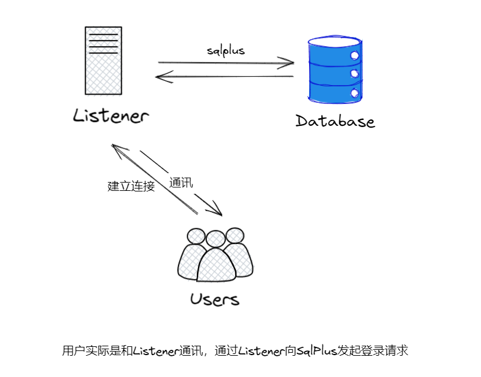
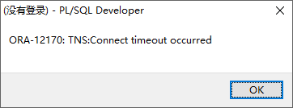
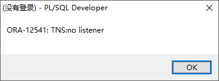
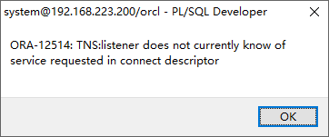
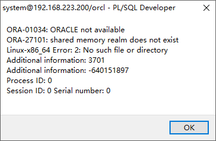
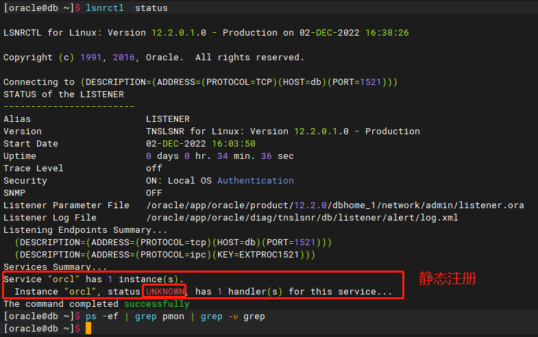
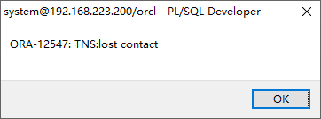
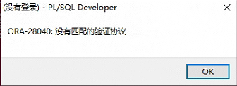

## ORACLE监听管理
Oracle 监听器 Listener 是一个重要的数据库服务器组件，它负责管理 Oracle 数据库和客户端之间的通讯，它在一个特定的网卡端口（默认是TCP 1521端口）上监听连接请求，并将连接转发给数据库。



### 一、监听的作用

- **为客户端请求分配Server Process**
  
  监听器只负责接听请求，之后将请求转接给Oracle Server Process。在Oracle的服务模式下，客户端进程是不允许直接操作数据库实例和数据，而是通过一个服务进程Server Process（也称为影子进程）作为代理。监听器接受到请求之后，就向操作系统（或者Dispatcher组件）要求分配一个Server Process与客户端相连。
  这里的分配有两种模式：专用连接模式、共享连接模式。如果是专用连接模式，也就是一个客户端连接对应一个 Server Process。监听器就会向 OS 请求 fork（创造）出一个 Server Process，与监听器尝试交互，这也是默认的连接模式。如果是共享连接模式，也就是多个客户端共享一个 Server Process（注意：这里还不是连接池）。监听器就会向 Dispatcher 进程（管理共享模式连接的进程）请求一个 Server Process 与之交互。
- **注册实例服务**
  
  本质上讲，listener是建立实例和客户端进程之间联系的桥梁。Listener与实例之间的联系，就是通过注册的过程来实现的。注册的过程就是实例告诉监听器，它的数据库数据库实例名称instance_name和服务名service_names。监听器注册上这样的信息，对客户端请求根据监听注册信息，找到正确的服务实例名称。目前Oracle版本中，提供动态注册和静态注册两种方式。
- **错误转移failover**
  
  Failover是RAC容错的一个重要方面功能，其功能是在数据库实例崩溃的时候，可以自动将请求转移到其他可用实例上的一种功能。可以提供很大程度上的可用性（Availability）功能。这个过程中，发现实例已经崩溃，并且将请求转移到其他实例上，就属于是listener的功能。
- **负载均衡**
  
  在RAC架构中，Oracle实现了负载均衡。当一个客户请求到来时，Oracle会根据当前RAC集群环境中所有实例的负载情况，避开负载较高的实例，将请求转移到负载较低的实例进行处理。在早期RAC版本中，负载轻重的衡量是根据监听器当前维护连接数目来确定的，而不是实时查看多实例的负载。RAC环境中的监听器之间进行沟通通信。

### 二、监听连接过程

监听连接的简要过程：

1. 客户端发起一个请求。
2. 数据库监听进程捕获到该服务请求，验证端口服务的正确性。
3. 监听器向服务器申请内存地址和端口。
4. 监听器将客户端的请求信息写入新创建的服务进程。
5. 监听器将新的服务信息传递给客户端。
6. 客户端重定向连接到新的服务进程上。
7. 客户端将帐号密码发送服务端。
8. 服务端进行验证。
9. 监听器工作结束。

### 三、监听分类

监听有2种类型：动态监听和静态监听。

#### 1.动态监听

动态注册不需要显示的配置listener.ora文件，实例启动时，由PMON或者LREG（Oracle 12C 之后监听的注册由专有进程LREG 负责）就会根据instance_name,service_name参数将实例和服务动态注册到listerer中。实例未启动，不监听任何实例。

动态注册的监听，只有当数据库启动时，才可以远程连接。

监听和实例的启动顺序，当监听先启动，没问题，如果监听后启动，那么可以手工alter system register注册下，或者不用管，PMON或者LREG会隔一段时间（默认是60s）就去注册下。

#### 2.静态监听

静态注册需要显示的配置listener.ora文件，监听启动时，读取listener.ora配置文件，将实例和服务注册到监听程序。无论何时启动数据库，默认地都有两条信息注册到监听器中：数据库服务器对应的实例和服务。实例状态为UNKNOWN值时表明此服务是静态注册的设置。这时监听器用来表明它不知道关于该实例的任何信息，只有当客户发出连接请求时，它才检查该实例是否存在。

静态注册的监听，无论数据库是否启动，都可以连接，也就是说，可以通过静态监听远程启动停止数据库，而动态监听不可以。

### 四、监听器的操作

#### 配置动态监听

监听的配置文件为$ORACLE_HOME/network/admin/listener.ora，默认监听的名称是LISTENER，配置如下，实际上没有这个listener.ora，默认listen也是可以正常运行的。

```sh
[oracle@db ~]$ vim $ORACLE_HOME/network/admin/listener.ora
LISTENER =
  (DESCRIPTION_LIST =
    (DESCRIPTION =
      (ADDRESS = (PROTOCOL = TCP)(HOST = db)(PORT = 1521))
    )
  )
```

定义一个新的监听

```sh
[oracle@db ~]$ vim $ORACLE_HOME/network/admin/listener.ora
LISTENER2 =
  (DESCRIPTION_LIST =
    (DESCRIPTION =
      (ADDRESS = (PROTOCOL = TCP)(HOST = db)(PORT = 1522))
    )
  )
```

PS：动态注册使用其他端口时，需要修改[#监听管理#local_listener|local_listener](#一、监听的作用)。

#### 配置静态监听

```sh
[oracle@db ~]$ vim $ORACLE_HOME/network/admin/listener.ora
LISTENER =
  (DESCRIPTION_LIST =
    (DESCRIPTION =
      (ADDRESS = (PROTOCOL = TCP)(HOST = db)(PORT = 1521))
    )
  )
SID_LIST_LISTENER=
  (SID_LIST=
    (SID_DESC=
      (GLOBAL_DBNAME=orcl)
      (ORACLE_HOME=/oracle/app/oracle/product/12.2.0/dbhome_1)
      (SID_NAME=orcl)
    )
  )
```

定义一个新的监听

```sh
[oracle@db ~]$ vim $ORACLE_HOME/network/admin/listener.ora
LISTENER2 =
  (DESCRIPTION_LIST =
    (DESCRIPTION =
      (ADDRESS = (PROTOCOL = TCP)(HOST = db)(PORT = 1522))
    )
  )
SID_LIST_LISTENER2=
  (SID_LIST=
    (SID_DESC=
      (GLOBAL_DBNAME=orcl)
      (ORACLE_HOME=/oracle/app/oracle/product/12.2.0/dbhome_1)
      (SID_NAME=orcl)
    )
  )
```

#### 启动关闭监听

```sh
#启动监听（LISTENER可以省略）
[oracle@db ~]$ lsnrctl start
[oracle@db ~]$ lsnrctl start LISTENER2

#停止监听
[oracle@db ~]$ lsnrctl stop
[oracle@db ~]$ lsnrctl stop LISTENER2

#查看监听
[oracle@db ~]$ lsnrctl status
[oracle@db ~]$ lsnrctl status LISTENER2
```

### 五、参数

#### local_listener

该参数指定了数据库需要将数据库实例注册到哪个端口，如果没有设置这个参数，默认将数据库的服务注册到本地节点的1521端口。

```sql
SQL> show parameter local_listener;
NAME				     TYPE	 VALUE
------------------------------------ ----------- ------------------------------
local_listener			     string	  (ADDRESS=(PROTOCOL=TCP)(HOST=192.168.199.157)(PORT=1521))
```

修改默认注册信息

```sql
alter system set LOCAL_LISTENER='(ADDRESS=(PROTOCOL=TCP)(HOST=192.168.199.157)(PORT=1522))';
```

这里也可以使用别名，现在tnsnames.ora中添加配置信息，如下

```sh
LISTENER_ORCL =
  (ADDRESS = (PROTOCOL = TCP)(HOST = db)(PORT = 1521))
```

再设置local_listener

```sql
alter system set LOCAL_LISTENER='LISTENER_ORCL';
```


## 连接数据库常见问题
#### 问题1：ORA-12170: TNS:Connect timeout occurred



可能原因：

-   IP不通、端口不通
-   服务器开启了防火墙但未放行客户端ip

#### 问题2：ORA-12541: TNS:no listener



可能原因：

-   IP能通但端口不通
-   监听服务未启动
-   监听程序未正常工作（一般原因是监听日志过大）

#### 问题3：ORA-12514: TNS:listener does not currently know of service requested in connect descriptor



可能原因：

-   指定的服务名或实例名未注册到监听器上。

#### 问题4：ORA-27101: shared memory realm does not exist



可能原因：

-   监听器添加了静态注册，连接到了静态注册上，但该实例并未启动。



#### 问题5：ORA-12547: TNS:lost contact



可能原因：

-   监听器开启了白名单但未放行客户端ip

#### 问题6：ORA-28040:没有匹配的验证协议



原因：

客户端版本过低，可更换和数据库版本相同的客户端版本，或者修改允许连接到数据库服务器上的最小客户端版本。

修改允许的最小客户端版本方法如下：

切换到oracle用户，在`$ORACLE_HOME/network/admin/sqlnet.ora`中加入以下参数即可，不用重启数据库或者监听，也不用重启应用：

```sh
SQLNET.ALLOWED_LOGON_VERSION_SERVER=8
SQLNET.ALLOWED_LOGON_VERSION_CLIENT=8
```

PS：若数据库是RAC集群，也是一样的操作，所有节点都要执行。
## Oracle的三种验证机制
ORACLE数据库有三种验证机制：

- 操作系统验证（具有sysdba（拥有最高的系统权限，登陆后的用户是 sys）和sysoper（主要用来启动、关闭数据库，登陆后的用户是 public）的用户）
- 密码文件验证（具有sysdba和sysoper的用户）
- 数据库验证（普通用户）

### 操作系统验证

操作系统验证需要操作系统用户拥有dba或者oper组权限，操作系统验证通过 sqlplus / as sysdba 或 sqlplus / as sysoper 登录，不需要输入账号密码，输错了也不影响。

允许操作系统验证需要满足两个条件：

1. linux下当前操作系统用户属于dba组和oper组（对应sysdba和sysoper），windows下当前操作系统用户属于ora_dba组。
2. 在sqlnet.ora中设置`SQLNET.AUTHENTICATION_SERVICES`的值，linux下设置为ALL（默认值），windows下设置为NTS。

开启操作系统验证：

```sh
#保证oracle用户属于dba组和oper组（对应sysdba和sysoper）
[oracle@db ~]$ id
uid=54321(oracle) gid=54321(oinstall) 组=54321(oinstall),54322(dba),54323(oper),54324(backupdba),54325(dgdba),54326(kmdba)

#修改SQLNET.AUTHENTICATION_SERVICES参数
[oracle@db ~]$ vi $ORACLE_HOME/network/admin/sqlnet.ora
SQLNET.AUTHENTICATION_SERVICES=ALL    --linux下可以默认为ALL，可以不加
```

开启操作系统验证后，通过以下方式登录：

```sql
sqlplus / as sysdba
sqlplus sys/password as sysdba    --账号密码对错不影响登录
sqlplus / as sysoper
sqlplus sys/password as sysoper    --账号密码对错不影响登录
```

操作系统验证也可以通过远程登录，相关参数是remote_os_authent和os_authent_prefix，remote_os_authent这个参数开启后,存在很大的安全隐患，远端服务器只要根据数据库中存在的外部用户来创建用户,就可以登陆到数据库中,因此除非必要,否则不建议开启这个参数。这里不具体介绍。

### 密码文件验证

密码文件存储具有 sysdba 和 sysoper 权限的用户名和密码，具有 sysdba 和 sysoper 权限的用户需要使用正确的账号和密码进行登录，本地和远程登录都可以。

具有 sysdba 和 sysoper 权限的用户只能通过操作系统验证和密码文件验证的方式登录。

`REMOTE_LOGIN_PASSWORDFILE`参数用于设置是否检查密码文件。

密码文件位置：

- linux下：`$ORACLE_HOME/dba/orapw$ORACLE_SID`
- windows下：`%ORACLE_HOME%/database/PWD$ORACLE_SID.ora`

密码文件可以用`orapw`生成。

### 数据库验证

这是Oracle用户最常用的身份验证方法。当使用密码身份验证进行连接时，实例针对数据字典中用户帐户中存储的密码，验证给定的密码。为此，数据库必须处于打开状态。

## Oracle设置开机启动
### 方式一

修改/etc/oratab（将N改为Y）

```sh
[root@db ~]# vi /etc/oratab
#orcl:/oracle/app/oracle/product/12.2.0/dbhome_1:N
orcl:/oracle/app/oracle/product/12.2.0/dbhome_1:Y
```

设置开机启动（注意修改ORACLE_HOME和ORA_OWNER为实际值）

```sh
[root@db ~]# vi /etc/init.d/oracle
添加以下内容：
#!/bin/sh
## chkconfig: 35 80 10
## description: Oracle auto start-stop script.

#
## Set ORACLE_HOME to be equivalent to the $ORACLE_HOME
## from which you wish to execute dbstart and dbshut;
#
## Set ORA_OWNER to the user id of the owner of the
## Oracle database in ORACLE_HOME.

#需要根据具体情况修改
ORACLE_HOME=/oracle/app/oracle/product/12.2.0/dbhome_1
#需要根据具体情况修改
ORA_OWNER=oracle

if [ ! -f $ORACLE_HOME/bin/dbstart ]
then
    echo "Oracle startup: cannot start"
    exit
fi

case "$1" in
    'start')
        ## Start the Oracle databases:
        echo "Starting Oracle Databases ... "
        echo "-------------------------------------------------" >> /var/log/oracle.log
        date +" %T %a %D : Starting Oracle Databases as part of system up." >> /var/log/oracle.log
        echo "-------------------------------------------------" >> /var/log/oracle.log
        su - $ORA_OWNER -c "$ORACLE_HOME/bin/dbstart $ORACLE_HOME" >>/var/log/oracle.log
        echo "Done"

        ## Start the Listener:
        echo "Starting Oracle Listeners ... "
        echo "-------------------------------------------------" >> /var/log/oracle.log
        date +" %T %a %D : Starting Oracle Listeners as part of system up." >> /var/log/oracle.log
        echo "-------------------------------------------------" >> /var/log/oracle.log
        su - $ORA_OWNER -c "$ORACLE_HOME/bin/lsnrctl start" >>/var/log/oracle.log
        echo "Done."
        echo "-------------------------------------------------" >> /var/log/oracle.log
        date +" %T %a %D : Finished." >> /var/log/oracle.log
        echo "-------------------------------------------------" >> /var/log/oracle.log
        touch /var/lock/subsys/oracle
        ;;

    'stop')
        ## Stop the Oracle Listener:
        echo "Stoping Oracle Listeners ... "
        echo "-------------------------------------------------" >> /var/log/oracle.log
        date +" %T %a %D : Stoping Oracle Listener as part of system down." >> /var/log/oracle.log
        echo "-------------------------------------------------" >> /var/log/oracle.log
        su - $ORA_OWNER -c "$ORACLE_HOME/bin/lsnrctl stop" >>/var/log/oracle.log
        echo "Done."
        rm -f /var/lock/subsys/oracle

        ## Stop the Oracle Database:
        echo "Stoping Oracle Databases ... "
        echo "-------------------------------------------------" >> /var/log/oracle.log
        date +" %T %a %D : Stoping Oracle Databases as part of system down." >> /var/log/oracle.log
        echo "-------------------------------------------------" >> /var/log/oracle.log
        su - $ORA_OWNER -c "$ORACLE_HOME/bin/dbshut $ORACLE_HOME" >>/var/log/oracle.log
        echo "Done."
        echo ""
        echo "-------------------------------------------------" >> /var/log/oracle.log
        date +" %T %a %D : Finished." >> /var/log/oracle.log
        echo "-------------------------------------------------" >> /var/log/oracle.log
        ;;

    'restart')
        $0 stop
        $0 start
        ;;

     *)
        echo "Usage: oracle {start|stop|restart}"
        exit 1
esac
[root@db ~]# chmod +x /etc/init.d/oracle
[root@db ~]# chkconfig oracle on
```

测试

```sh
[root@db ~]# service oracle start
[root@db ~]# service oracle stop
```

### 方式二

修改/etc/oratab（将N改为Y）

```sh
[root@db ~]# vi /etc/oratab
#orcl:/oracle/app/oracle/product/12.2.0/dbhome_1:N
orcl:/oracle/app/oracle/product/12.2.0/dbhome_1:Y
```

添加启动/关闭脚本（/oracle/app/oracle/product/12.2.0/dbhome_1是$ORACLE_HOME，根据实际情况修改）

```sh
[root@db ~]# cat > /oracle/app/oracle/product/12.2.0/dbhome_1/bin/start_all <<EOF
#!/bin/bash
. /home/oracle/.bash_profile

export ORAENV_ASK=NO
. oraenv
export ORAENV_ASK=YES

dbstart \$ORACLE_HOME
EOF
[root@db ~]# cat > /oracle/app/oracle/product/12.2.0/dbhome_1/bin/stop_all <<EOF
#!/bin/bash
. /home/oracle/.bash_profile

export ORAENV_ASK=NO
. oraenv
export ORAENV_ASK=YES

dbshut \$ORACLE_HOME
EOF
[root@db ~]# chown oracle:oinstall /oracle/app/oracle/product/12.2.0/dbhome_1/bin/start_all
[root@db ~]# chown oracle:oinstall /oracle/app/oracle/product/12.2.0/dbhome_1/bin/stop_all
[root@db ~]# chmod u+x /oracle/app/oracle/product/12.2.0/dbhome_1/bin/start_all
[root@db ~]# chmod u+x /oracle/app/oracle/product/12.2.0/dbhome_1/bin/stop_all
```

设置开机启动（/oracle/app/oracle/product/12.2.0/dbhome_1是$ORACLE_HOME，根据实际情况修改）

```sh
[root@db ~]# cat > /lib/systemd/system/oracle.service << EOF
[Unit]
Description=The Oracle Database Service
After=syslog.target network.target

[Service]
## systemd ignores PAM limits, so set any necessary limits in the service.
## Not really a bug, but a feature.
## https://bugzilla.redhat.com/show_bug.cgi?id=754285
LimitMEMLOCK=infinity
LimitNOFILE=65535

#Type=simple
## idle: similar to simple, the actual execution of the service binary is delayed
##       until all jobs are finished, which avoids mixing the status output with shell output of services.
RemainAfterExit=yes
User=oracle
Group=oinstall
Restart=no
ExecStart=/bin/bash -c '/oracle/app/oracle/product/12.2.0/dbhome_1/bin/start_all'
ExecStop=/bin/bash -c '/oracle/app/oracle/product/12.2.0/dbhome_1/bin/stop_all'

[Install]
WantedBy=multi-user.target
EOF
[root@db ~]# systemctl daemon-reload
[root@db ~]# systemctl enable oracle
```

测试

```sh
[root@db ~]# systemctl start oracle
[root@db ~]# systemctl stop oracle
```

## 逻辑备份
### 逻辑备份常用方法

逻辑备份常用的方法有exp/imp和expdp/impdp。

exp/imp是客户端工具程序，它们既可以在客户端使用，也可以在服务端使用。

expdp/impdp是服务端的工具程序，他们只能在oracle服务端使用，不能在客户端使用。

exp/imp产生的文件格式和expdp/impdp并不兼容，虽然文件名字都dmp扩展文件。imp只适用于exp导出的文件，不适用于expdp导出文件；impdp只适用于expdp导出的文件，而不适用于exp导出文件。

对于10g以上的服务器，使用exp通常不能导出0行数据的空表，此时一般使用expdp导出。

exp导出是按字母顺序导出，而expdp导出表的顺序是随机的。

默认同等情况下(不加压缩这样的参数)，expdp导出快些，且生成文件占用磁盘空间也相对少些。

exp可以read only模式下操作，而expdp不行。在expdp导出过程中会建立一个job且 会产生一张表SYS_EXPORT_SCHEMA_01 ， 导完后又会自动删除， 所以 expdp无法在read only模式下操作。

### 传统的导入导出工具 - EXP/IMP

#### 命令说明

exp常见参数：

-   userid：指定登陆exp的用户名和密码。如：userid=system/oracle@orcl
-   full：导出整个数据库。（N）
-   tables：指定导出的表名列表。如：tables=(t1)，tables=(t1,t2)
-   query：导出指定条件的数据，该参数需要跟tables一起使用。整个where子句需要使用""括起来，where子句的写法和SELECT中相同。><'等特殊字符需要转译。如：tables=testtable query="where id=20 and name=test"，tables=testtable query="where c1>20 and c2=to_date('20090506','yyyymmdd')"
-   compress：是否压缩导出的文件。（Y）
-   statistics：是否导出统计信息。取值范围：COMPUTE (统计值)，ESTIMATE(估算值)(默认值)，NONE(不导出)
-   owner：导出指定用户下的所有数据。如：owner=web，owner=(web,oss03)
-   file：输出文件。如：file=xxx.dmp，file=xxx01.dmp,xxx01.dmp
-   log：屏幕输出的日志文件。
-   grants：是否导出权限。（Y）
-   buffer：指定数据缓冲区大小。默认4096byte。（经测试，合理的buffer值是10240000-1024000之间，再大了反而效率更低。）
-   indexes：导出索引。（Y）
-   rows：是否导出数据行。（Y）
-   filesize：各转储文件最大尺寸。如：filesize=5G
-   tablespaces：要导出的可传输的表空间。导出表空间时需要将表空间置为只读状态。导入导出的字符集必须一致，必须使用sys用户操作。
-   transport_tablespace：导出可传输的表空间元数据。（N）(transport_tablespace=y 表示启用表空间导出,但是无法导出数据，所以要想导出数据就不要添加该参数)
-   feedback：每x行显示运行进度。
-   help=y：查看帮助。

imp常见参数：

-   userid：指定登陆exp的用户名和密码。如：userid=system/oracle@orcl
-   full：导入整个数据库。（N）
-   tables：指定导入的表名列表。如：tables=(t1)，tables=(t1,t2)
-   file：输入文件。如：file=xxx.dmp，file=xxx01.dmp,xxx01.dmp
-   log：屏幕输出的日志文件。
-   ignore：忽略创建错误。只是报不报错而已，不影响导入过程，一般不加该参数，通过日志确认该问题可忽略的话不理会就行。（N）
-   buffer：指定数据缓冲区大小。默认4096byte
-   fromuser：将dmp文件中的哪个用户导入
-   touser：将fromuser指定的用户数据导入到指定用户
-   grants：是否导入权限。（Y）
-   indexes：导入索引。（Y）
-   rows：是否导入数据行。（Y）
-   filesize：各转储文件最大尺寸。如：filesize=5G
-   statistics：是否导入预计算的统计信息。
-   tablespaces：要导入的表空间。导入的数据库字符集要和导出的字符集一致，必须使用sys用户操作。
-   transport_tablespace：导入表空间元数据。（N）
-   datafiles：导入后的数据文件路径与文件名。
-   feedback：每x行显示运行进度。
-   help=y：查看帮助。

PS：oracle imp 导入可以使用 ignore=y 参数进行覆盖数据库。如果不使用 ignore=y 参数在进行imp 导入时，对已经存在的表就不会进行导入，如果加上ignore=y 参数就会对已经存在的表中没有的记录进行更新，但对已经存在记录不会进行覆盖修改。

#### 设置NLS_LANG

使用exp/imp前，要注意字符集，尽量避免出现字符集转换的情况。

查看数据库字符集

```sh
SQL> select userenv('language') from dual;

USERENV('LANGUAGE')
----------------------------------------------------
AMERICAN_AMERICA.AL32UTF8
```

我这里数据库使用的字符集是AMERICAN_AMERICA.AL32UTF8，在使用exp/imp的客户端上设置环境变量NLS_LANG的值

```sh
[oracle@db ~]$ vi /home/oracle/.bash_profile 
export NLS_LANG=AMERICAN_AMERICA.AL32UTF8
[oracle@db ~]$ source /home/oracle/.bash_profile
[oracle@db ~]$ echo $NLS_LANG 
AMERICAN_AMERICA.AL32UTF8
```

#### 常用操作

##### 表

导出表

```sh
#导出单张表
exp userid=hr/hr@192.168.223.200:1521/orcl file=/backup/employees.dmp log=/backup/employees.log tables=employees

#导出多张表
exp userid=hr/hr@192.168.223.200:1521/orcl file=/backup/hr.dmp log=/backup/hr.log tables="(employees,departments)"
exp userid=hr/hr@192.168.223.200:1521/orcl file=/backup/hr.dmp log=/backup/hr.log tables=employees,departments

#带条件导出某张表
exp userid=hr/hr@192.168.223.200:1521/orcl file=/backup/employees.dmp log=/backup/employees.log tables=employees query=\'where employee_id=\'\'100\'\'\'
```

导入表

```sh
imp userid=hr/hr@192.168.223.200:1521/orcl file=/backup/employees.dmp log=/backup/employees.log tables=employees

#跨用户导入时，需要使用fromuser/touser，否则用哪个用户导入的，对象就会导入到该用户中
imp userid=system/oracle@192.168.223.200:1521/orcl file=/backup/employees.dmp log=/backup/employees.log tables=employees fromuser=hr touser=hr
```

##### 用户

导出用户

```sh
exp userid=hr/hr@192.168.223.200:1521/orcl file=/backup/hr.dmp log=/backup/hr.log owner=hr
#要导出的用户和连接用户一致是可以省略owner。

#跨用户导出时，需要有dba权限。
exp userid=system/oracle@192.168.223.200:1521/orcl file=/backup/hr.dmp log=/backup/hr.log owner=hr
exp userid=system/oracle@192.168.223.200:1521/orcl file=/backup/hr.dmp log=/backup/hr.log owner=hr,scott
```

导入用户

```sh
imp userid=hr/hr@192.168.223.200:1521/orcl file=/backup/hr.dmp log=/backup/hr.log fromuser=hr touser=hr
#若dmp文件中有多个用户的数据，使用fromuser只会导入fromuser指定的用户

#跨用户导入时，需要使用fromuser/touser，否则用哪个用户导入的，对象就会导入到该用户中
imp userid=system/oracle@192.168.223.200:1521/orcl file=/backup/hr.dmp log=/backup/hr.log fromuser=hr touser=scott
```

##### 表空间

略。

##### 全库

导出全库

```sh
exp userid=system/oracle@192.168.223.200:1521/orcl file=/backup/full.dmp log=/backup/full.log full=y
#连接用户需要有dba权限。
```

导入全库

```sh
imp userid=system/oracle@192.168.223.200:1521/orcl file=/backup/full.dmp log=/backup/full.log full=y
#已存在的表不会进行导入

imp userid=system/oracle@192.168.223.200:1521/orcl file=/backup/full.dmp log=/backup/full.log full=y ignore=y
#会对已经存在的表中没有的记录进行更新，但对已经存在记录不会进行覆盖修改
```

##### 其他

只导出表结构

```sh
exp userid=system/oracle@192.168.223.200:1521/orcl file=/backup/full.dmp log=/backup/full.log full=y rows=n
#关键参数：rows=n
```

### 数据泵（Data Pump） - EXPDP/IMPDP

#### 命令说明

expdp常见参数：

- directory：可以理解为实际绝对路径在oracle数据库里的别名，是导出文件的存储位置
- dumpfile：指定导出文件的名称
- logfile：指定导出日志的名称
- nologfile：不生成导出日志
- full：全库导出
- tables：指定导出哪些表
- schemas：指定导出的用户
- tablespaces：指定导出的表空间
- exclude：用于排除不需要导出的对象
- include：指定导出对象
- job_name：指定任务名，如果不指定的话，系统会默认自动命名
- parallel：指定并行进程个数，默认为1
- query：指定在导出时的限制条件
- filesize：指定每个转储文件的大小
- extimate_only：估算导出数据大小容量，不导出数据
- estimate：指定进行容量估算的方式。一种是通过数据块(blocks)数量、一种是通过统计信息中记录的内容(statistics)估算
- attach：使用attach参数可以进入到已存在的作业的交互模式
- network_link：可通过本地数据库里的db_link连接到其他数据库A，导出数据库A的数据
- parfile：指定参数文件。可以将用到的参数加到文件中，导出时直接指定该文件
- version：指定导出的文件的数据库版本。一般在导出时使用。
- content：指定导出内容，包括三个级别：全部／数据／元数据（结构）。ALL表示导出所有数据，包括元数据及数据；DATA_ONLY表示只导出数据；METADATA_ONLY表示只导出元数据，就是创建语句
- cluster：当数据库是RAC时，使用该参数（cluster=n），否则所有节点都会运行导出任务。

impdp常见参数：

- directory：可以理解为实际绝对路径在oracle数据库里的别名，是导入文件的存储位置
- dumpfile：指定导入文件的名称
- logfile：指定导入日志的名称
- nologfile：不生成导入日志
- full：全库导入
- tables：指定导入哪些表
- schemas：指定导入的用户
- tablespaces：指定导入的表空间
- exclude：用于排除不需要导入的对象
- include：指定导入对象
- job_name：指定任务名，如果不指定的话，系统会默认自动命名
- parallel：指定并行进程个数，默认为1
- query：指定在导入时的限制条件
- attach：使用attach参数可以进入到已存在的作业的交互模式
- network_link：可通过本地数据库里的db_link连接到其他数据库A，将数据库A的数据直接导入到本地数据库
- parfile：指定参数文件。可以将用到的参数加到文件中，导入时直接指定该文件
- content：指定导入内容，包括三个级别：全部／数据／元数据（结构）。ALL表示导入所有数据，包括元数据及数据；DATA_ONLY表示只导入数据；METADATA_ONLY表示只导入元数据
- remap_schema：当把用户（模式）A的对象导入到用户（模式）B时，使用此参数
- remap_tablespace：当把表空间A迁移到表空间B时，使用此参数
- table_exists_action：导入时，假如目标库中已存在对应的表，对于这种情况，提供三种不同的处理方式：append/truncate/skip/replace。append表示追加数据到表中；truncate表示将目标库中的同名表的数据truncate掉；skip表示遇到同名表，则跳过，不进行处理；replace表示导入过程中，遇到同名表，则替换到目标库的那张表（先drop，再创建）
- sqlfile：将DMP文件中的metadata语句取出到一个单独的SQLfile中，并不导入到数据库中

#### directory

使用expdp/impdp时需要先创建directory目录，指定转储文件和日志文件所在的目录。

```sh
create directory dump_dir as '/backup';
#这里指定的目录在操作系统中要创建好

#普通用户需要授权，有dba权限的不需要
grant read,write on directory dump_dir to hr;
```

#### 常用操作

##### 表

导出表

```sh
expdp system/oracle directory=dump_dir dumpfile=employees.dmp logfile=employees.log tables=hr.employees

expdp hr/hr directory=dump_dir dumpfile=employees.dmp logfile=employees.log tables=employees,departments
```

导入表

```sh
impdp hr/hr directory=dump_dir dumpfile=employees.dmp logfile=employees.log tables=employees,departments
#默认导入到表的所属用户下，不像imp要注意导入时的用户
```

##### 用户

导出用户

```sh
expdp hr/hr directory=dump_dir dumpfile=hr.dmp logfile=hr.log schemas=hr
#要导出的用户和连接用户一致是可以省略schemas。
```

导入用户

```sh
impdp hr/hr directory=dump_dir dumpfile=hr.dmp logfile=hr.log schemas=hr

#跨用户
impdp system/oracle directory=dump_dir dumpfile=hr.dmp logfile=hr.log schemas=hr remap_schema=hr:scott

#跨表空间
impdp system/oracle directory=dump_dir dumpfile=hr.dmp logfile=hr.log schemas=hr remap_tablespace=tbshr:tbshr2
```

##### 表空间

略。

##### 全库

导出全库

```sh
expdp system/oracle directory=dump_dir dumpfile=full.dmp logfile=full.log full=y
```

导入全库

```sh
impdp system/oracle directory=dump_dir dumpfile=full.dmp logfile=full.log full=y
```

##### 其他

只导出表结构

```sh
expdp system/oracle directory=dump_dir dumpfile=full.dmp logfile=full.log full=y content=metadata_only
```

并行导出

```sh
expdp system/oracle directory=dump_dir dumpfile=full.dmp logfile=full.log full=y parallel=6
```

限制单个文件大小

```sh
expdp system/oracle directory=dump_dir dumpfile=full_%U.dmp logfile=full.log full=y parallel=6 filesize=2g
```

## 跨版本导出导入问题

使用exp/imp版本问题：

1. 低版本的exp/imp可以连接到高版本（或同版本）的数据库服务器，但高版本的exp/imp不能连接到低版本的数据库服务器。
2. 高版本exp出的dmp文件，低版本无法imp（无法识别dmp文件）；低版本exp出的dmp文件，高版本可以imp（向下兼容），但限于Oracle的相邻版本。

使用expdp/impdp版本问题：

1. 从高版本向低版本迁移，需指定目标端低版本的version（高版本导出，低版本导入，在导出时需要指定导入的version）。
2. 从低版本向高版本迁移，可以不指定。

## 关于字符集AL32UTF8和ZHS16GBK的转换

不管是`从AL32UTF8 到ZHS16GBK` 还是`从ZHS16GBK 到AL32UTF8` ，中文都不会乱码，会自动转换（导出导入过程中无报错），但是对于其他国家语言会有问题（比如印度，日本等文字）。

通过数据泵导出或导入的数据，与oracle用户操作系统参数`NLS_LANG`无关，编码自动与数据库参数`NLS_CHARACTERSET`相同。

使用EXP/IMP工具将按照`NLS_LANG`定义的方式调用字符集文件，并且在服务器和客户端之间根据设置进行字符集转换。在执行导出数据操作时，导出使用的字符集将会记录在导出的DMP文件中，当文件导入时，将会检查导出时使用的字符集设置，如果这个字符集不同于导入客户端的`NLS_LANG`设置，字符集将根据导入客户端`NLS_LANG`设置进行转换。所以通常在执行导出操作时，最好把客户端字符集设置得和数据库相同，这样可以避免在导出时发生不必要的数据转换，导出文件将和数据库具有相同的字符集，数据得以完好备份。即使将来会把导出文件导入到不同字符集的数据库中，这样做也可以把转换延缓至导入时刻。

AL32UTF8 字符集一个中文占用3个字节，ZHS16GBK 字符集一个中文占用2个字节。如果确认应用程序只用到英文和中文，ZHS16GBK会更加节省存储。如果不确定，建议使用AL32UTF8。

建表时指定列属性varchar(10)，其中的10指的是字节，若是AL32UTF8 字符集，则只能存3个中文，若是ZHS16GBK字符集，则可以存5个中文。这会导致从ZHS16GBK字符集数据库通过数据泵或EXP/IMP工具导入到AL32UTF8字符集数据库过程中，有些列需要扩容。如果需要按字符指定列属性，应该为varchar2（10 char）。

AL32UTF8是ZHS16GBK的超集，因为AL32UTF8包含了更多国家的文字。

通过SecureCRT或xshell查看到中文乱码时，只需要查看数据库`NLS_DATABSE_PARAMETERS`中`NLS_CHARACTERSET`的字符集是什么，然后保持操作系统用户`NLS_LANG`的设置和SecureCRT或xshell软件的编码设置与之一致即可。

## Oracle设置exp备份
创建备份目录

```sh
root用户执行
[root@db ~]# mkdir -p /oracle/oracle_backup/scripts
[root@db ~]# mkdir -p /oracle/oracle_backup/exp
[root@db ~]# chown oracle. /oracle/oracle_backup -R
```

添加备份脚本

```sh
[oracle@db ~]$ vi /oracle/oracle_backup/scripts/lyexpfull.sh
添加以下内容：
#!/bin/bash
#This script is used to auto-backup full database by expdp.
#The full-backup is saved for 7 days.

echo "[`date '+%Y-%m-%d %H:%M:%S'`]备份脚本开始启动..."

export BACKUPDATE=`date +%Y%m%d`
export ORACLE_SERVICE=192.168.223.200:1521/orcl
export NLS_LANG="AMERICAN_AMERICA.AL32UTF8"
#export NLS_LANG="SIMPLIFIED CHINESE_CHINA.ZHS16GBK"
export USERNAME1=sys
export PASSWORD1=Lyora_37621040
export BACKPATH=/oracle/oracle_backup/exp

echo "[`date '+%Y-%m-%d %H:%M:%S'`]现在开始进行数据备份..."
nohup exp \'$USERNAME1/$PASSWORD1@$ORACLE_SERVICE as sysdba\' file=$BACKPATH/expfull_$BACKUPDATE.dmp log=$BACKPATH/expfull_$BACKUPDATE.log full=y

echo "[`date '+%Y-%m-%d %H:%M:%S'`]数据备份结束..."

echo "[`date '+%Y-%m-%d %H:%M:%S'`]现在开始进行压缩备份数据..."
cd $BACKPATH
tar -czf $BACKUPDATE.tar.gz expfull_$BACKUPDATE* --remove-files
echo "[`date '+%Y-%m-%d %H:%M:%S'`]压缩备份数据结束..."

echo "[`date '+%Y-%m-%d %H:%M:%S'`]删除历史备份数据开始..."
find $BACKPATH -name '*.tar.gz' -mtime +7 -exec rm -f {} \;    #删除7天前的备份（注意：{} \中间有空格）
## find $BACKPATH -name '*.dmp' -mtime +7 -exec rm -f {} \;
## find $BACKPATH -name '*.log' -mtime +7 -exec rm -f {} \;
echo "[`date '+%Y-%m-%d %H:%M:%S'`]删除历史备份数据结束..."

echo "[`date '+%Y-%m-%d %H:%M:%S'`]备份执行完毕..."
```

授予执行权限

```sh
[oracle@db ~]$ chmod +x /oracle/oracle_backup/scripts/lyexpfull.sh
```

添加计划任务

```sh
[oracle@db ~]$ crontab -e
#每天凌晨1点对数据库进行全备
00 01 * * * /oracle/oracle_backup/scripts/lyexpfull.sh 2>&1
```
## Oracle设置expdp备份
创建备份目录

```sh
root用户执行
[root@db ~]# mkdir -p /oracle/oracle_backup/scripts
[root@db ~]# mkdir -p /oracle/oracle_backup/expdp
[root@db ~]# chown oracle. /oracle/oracle_backup -R
```

数据库创建directory

```SQL
[root@db ~]# su - oracle
[oracle@db ~]$ sqlplus / as sysdba
SQL> create or replace directory dump_dir as '/oracle/oracle_backup/expdp';
SQL> exit
```

添加备份脚本

```sh
[oracle@db ~]$ vi /oracle/oracle_backup/scripts/lyexpdpfull.sh
添加以下内容：
#!/bin/bash
#This script is used to auto-backup full database by expdp.
#The full-backup is saved for 7 days.

echo "[`date '+%Y-%m-%d %H:%M:%S'`]备份脚本开始启动..."

export BACKUPDATE=`date +%Y%m%d`
export ORACLE_SID=orcl
export NLS_LANG="AMERICAN_AMERICA.AL32UTF8"
#export NLS_LANG="SIMPLIFIED CHINESE_CHINA.ZHS16GBK"
export USERNAME1=sys
export PASSWORD1=Lyora_37621040
export directory=dump_dir
export BACKPATH=/oracle/oracle_backup/expdp

echo "[`date '+%Y-%m-%d %H:%M:%S'`]现在开始进行数据备份..."
#rac add path cluster=n
nohup expdp \'$USERNAME1/$PASSWORD1 as sysdba\' directory=$directory dumpfile=expdpfull_$BACKUPDATE-%U.dmp logfile=expdpfull_$BACKUPDATE.log parallel=6 full=y filesize=20g
#nohup expdp $USERNAME1/$PASSWORD1 directory=$directory dumpfile=expdpfull_$BACKUPDATE-%U.dmp logfile=expdpfull_$BACKUPDATE.log parallel=3 full=y filesize=20g
echo "[`date '+%Y-%m-%d %H:%M:%S'`]数据备份结束..."

echo "[`date '+%Y-%m-%d %H:%M:%S'`]现在开始进行压缩备份数据..."
cd $BACKPATH
tar -czf $BACKUPDATE.tar.gz expdpfull_$BACKUPDATE* --remove-files
echo "[`date '+%Y-%m-%d %H:%M:%S'`]压缩备份数据结束..."

echo "[`date '+%Y-%m-%d %H:%M:%S'`]删除历史备份数据开始..."
find $BACKPATH -name '*.tar.gz' -mtime +7 -exec rm -f {} \;    #删除7天前的备份（注意：{} \中间有空格）
## find $BACKPATH -name '*.dmp' -mtime +7 -exec rm -f {} \;
## find $BACKPATH -name '*.log' -mtime +7 -exec rm -f {} \;
echo "[`date '+%Y-%m-%d %H:%M:%S'`]删除历史备份数据结束..."

echo "[`date '+%Y-%m-%d %H:%M:%S'`]备份执行完毕..."
```

授予执行权限

```sh
[oracle@db ~]$ chmod +x /oracle/oracle_backup/scripts/lyexpdpfull.sh
```

添加计划任务

```sh
[oracle@db ~]$ crontab -e
#每天凌晨0点对数据库进行全备
00 00 * * * /oracle/oracle_backup/scripts/lyexpdpfull.sh 2>&1
```
## Oracle设置rman备份
创建备份目录

```sh
root用户执行
[root@db ~]# mkdir -p /oracle/oracle_backup/scripts
[root@db ~]# mkdir -p /oracle/oracle_backup/rman
[root@db ~]# chown oracle. /oracle/oracle_backup -R
```

设置备份保留策略

```sh
[oracle@db ~]$ rman target /
configure retention policy to recovery window of 7 days;
```

添加备份脚本

```sh
[oracle@db ~]$ vi /oracle/oracle_backup/scripts/lyrmanfull.sh
添加以下内容：
#author:
#usage: backup database for rman
source /home/oracle/.bash_profile

rman target / << EOF
run{
allocate channel c1 type disk;
allocate channel c2 type disk;
backup as compressed backupset database format '/oracle/oracle_backup/rman/%d_FULL_%T_%U';
backup current controlfile format '/oracle/oracle_backup/rman/%d_CONTROL_%T_%U';
backup as compressed backupset format '/oracle/oracle_backup/rman/%d_ARCH_%T_%U' archivelog all delete input;
release channel c1;
release channel c2;
crosscheck backup;
delete noprompt expired backup;
delete noprompt obsolete;
}
EOF
```

授予执行权限

```sh
[oracle@db ~]$ chmod +x /oracle/oracle_backup/scripts/lyrmanfull.sh
```

添加计划任务

```sh
[oracle@db ~]$ crontab -e
#每周日凌晨1点对数据库进行全备
00 01 * * 0 /oracle/oracle_backup/scripts/lyrmanfull.sh 2>&1
```
## 使用expdp(impdp)迁移数据
### 全库迁移

#### 导出数据

##### 创建directory

```sh
SQL> create directory dump_dir as '/oracle/oracle_backup';
[oracle@db ~]$ mkdir /oracle/oracle_backup
```

##### 导出数据

```sh
expdp \'/ as sysdba\' directory=dump_dir dumpfile=full.dmp logfile=expdp_full.log full=y
```

#### 导入数据

##### 创建directory

```sh
SQL> create directory dump_dir as '/oracle/oracle_backup';
[oracle@db ~]$ mkdir /oracle/oracle_backup
```

##### 拷贝导出文件到directory目录

```sh
#拷贝过程略
[oracle@db ~]$ ll -htr /oracle/oracle_backup
总用量 511M
-rw-r--r-- 1 oracle oinstall  34K 1月  10 14:50 expdp_full.log
-rw-r----- 1 oracle oinstall 511M 1月  10 14:50 full.dmp
```

##### 创建表空间

在源库获取创建表空间sql（默认已有的表空间（SYSTEM/SYSAUX/UNDOTBS1/USERS）无需创建），在目标库执行输出的sql

```sql
SELECT
	'create tablespace ' || S.TABLESPACE_NAME || ' datafile ''/oracle/app/oracle/oradata/orcl/' || lower( S.TABLESPACE_NAME ) || '_01.dbf'' size 10m autoextend on next 50m maxsize unlimited;' 
FROM
	SYS.DBA_DATA_FILES S 
WHERE
	S.TABLESPACE_NAME NOT IN ( 'SYSTEM', 'SYSAUX', 'UNDOTBS1', 'USERS' ) 
GROUP BY
	S.TABLESPACE_NAME;
```

查看表空间数据量

```sql
SELECT A.TABLESPACE_NAME, CEIL(( A.SUM - B.FREE ) / 1024 / 1024 
) USED_M 
FROM
	( SELECT TABLESPACE_NAME, SUM( BYTES ) SUM FROM SYS.DBA_DATA_FILES GROUP BY TABLESPACE_NAME ) A,
	( SELECT TABLESPACE_NAME, NVL( SUM( BYTES ), 0 ) FREE FROM SYS.DBA_FREE_SPACE GROUP BY TABLESPACE_NAME ) B 
WHERE
	A.TABLESPACE_NAME = B.TABLESPACE_NAME 
ORDER BY
	USED_M;
```

创建表空间时只有一个数据文件，一个数据文件默认最大值是32G，若表空间数据量大于32G，需要根据实际情况在目标库增加数据文件

```sh
alter tablespace <tablespace name> add datafile '/oracle/app/oracle/oradata/orcl/<tablespace name>_02.dbf' size 10m autoextend on next 50m maxsize unlimited;
```

在源库获取创建临时表空间sql（默认已有的临时表空间（TEMP）无需创建），在目标库执行输出的sql

```sh
SELECT
	'create temporary tablespace ' || TABLESPACE_NAME || ' TEMPFILE ''/oracle/app/oracle/oradata/orcl/' || lower( TABLESPACE_NAME ) || '_01.dbf'' size 10m autoextend on next 50m maxsize unlimited;' 
FROM
	DBA_TABLESPACES 
WHERE
	CONTENTS = 'TEMPORARY' 
	AND TABLESPACE_NAME != 'TEMP';
```

##### 导入数据

```sh
impdp \'/ as sysdba\' directory=dump_dir dumpfile=full.dmp logfile=impdp_full.log full=y
```

### 用户迁移

#### 导出数据

##### 创建directory

```sh
SQL> create directory dump_dir as '/oracle/oracle_backup';
[oracle@db ~]$ mkdir /oracle/oracle_backup
```

##### 导出数据

```sh
#这里以用户hr为例
expdp \'/ as sysdba\' directory=dump_dir dumpfile=hr.dmp logfile=expdp_hr.log schemas=hr
```

#### 导入数据

##### 创建directory

```sh
SQL> create directory dump_dir as '/oracle/oracle_backup';
[oracle@db ~]$ mkdir /oracle/oracle_backup
```

##### 拷贝导出文件到directory目录

```sh
#拷贝过程略
[oracle@db ~]$ ll -htr /oracle/oracle_backup
总用量 100M
-rw-r--r-- 1 oracle oinstall 18K 1月  10 16:20 expdp_hr.log
-rw-r----- 1 oracle oinstall 100M 1月  10 16:20 hr.dmp
```

##### 创建表空间

在源库获取指定用户的创建表空间sql，在目标库执行输出的sql

```sql
SELECT
	'create tablespace ' || S.TABLESPACE_NAME || ' datafile ''/oracle/app/oracle/oradata/orcl/' || lower( S.TABLESPACE_NAME ) || '_01.dbf'' size 10m autoextend on next 50m maxsize unlimited;' 
FROM
	SYS.DBA_DATA_FILES S 
WHERE
	S.TABLESPACE_NAME = ( SELECT DEFAULT_TABLESPACE FROM SYS.DBA_USERS WHERE USERNAME = 'HR' );
```

查看表空间数据量

```sql
SELECT A.TABLESPACE_NAME, CEIL(( A.SUM - B.FREE ) / 1024 / 1024 
) USED_M 
FROM
	( SELECT TABLESPACE_NAME, SUM( BYTES ) SUM FROM SYS.DBA_DATA_FILES GROUP BY TABLESPACE_NAME ) A,
	( SELECT TABLESPACE_NAME, NVL( SUM( BYTES ), 0 ) FREE FROM SYS.DBA_FREE_SPACE GROUP BY TABLESPACE_NAME ) B 
WHERE
	A.TABLESPACE_NAME = B.TABLESPACE_NAME 
	AND A.TABLESPACE_NAME = ( SELECT DEFAULT_TABLESPACE FROM SYS.DBA_USERS WHERE USERNAME = 'HR' );
```

创建表空间时只有一个数据文件，一个数据文件默认最大值是32G，若表空间数据量大于32G，需要根据实际情况在目标库增加数据文件

```sh
alter tablespace <tablespace name> add datafile '/oracle/app/oracle/oradata/orcl/<tablespace name>_02.dbf' size 10m autoextend on next 50m maxsize unlimited;
```

在源库获取指定用户的创建临时表空间sql（默认已有的临时表空间（TEMP）无需创建），在目标库执行输出的sql

```sh
SELECT
	'create temporary tablespace ' || TABLESPACE_NAME || ' TEMPFILE ''/oracle/app/oracle/oradata/orcl/' || lower( TABLESPACE_NAME ) || '_01.dbf'' size 10m autoextend on next 50m maxsize unlimited;' 
FROM
	DBA_TABLESPACES 
WHERE
	CONTENTS = 'TEMPORARY' 
	AND TABLESPACE_NAME != 'TEMP' 
	AND TABLESPACE_NAME = ( SELECT TEMPORARY_TABLESPACE FROM SYS.DBA_USERS WHERE USERNAME = 'HR' );
```

##### 导入数据

```sh
impdp \'/ as sysdba\' directory=dump_dir dumpfile=hr.dmp logfile=impdp_hr.log schemas=hr
```


### 表迁移

#### 导出数据

##### 创建directory

```sh
SQL> create directory dump_dir as '/oracle/oracle_backup';
[oracle@db ~]$ mkdir /oracle/oracle_backup
```

##### 导出数据

```sh
#这里以hr.employees为例
expdp \'/ as sysdba\' directory=dump_dir dumpfile=hr_employees.dmp logfile=expdp_hr_employees.log tables=hr.employees
```

#### 导入数据

##### 创建directory

```sh
SQL> create directory dump_dir as '/oracle/oracle_backup';
[oracle@db ~]$ mkdir /oracle/oracle_backup
```

##### 拷贝导出文件到directory目录

```sh
#拷贝过程略
[oracle@db ~]$ ll -htr /oracle/oracle_backup
总用量 10M
-rw-r--r-- 1 oracle oinstall 12K 1月  10 16:20 expdp_hr_employees.log
-rw-r----- 1 oracle oinstall 10M 1月  10 16:20 hr_employees.dmp
```

##### 导入数据

```sh
impdp \'/ as sysdba\' directory=dump_dir dumpfile=hr_employees.dmp logfile=impdp_hr_employees.log tables=hr.employees
```

### 常见问题

1. 若导入用户和表等对象时，源库对应的表空间和目标库不一致时，可以使用 remap_tablespace 修改表空间。

如：remap_tablespace=tbs_hr:tbs_hr2。将表空间tbs_hr的数据导入到表空间tbs_hr2。

2. 若导入用户时，要将用户A的数据导入到用户B时，可以使用 remap_schema 修改表空间。

如：remap_schema=用户A:用户B。将用户A的数据导入到用户B。

3. 若导入时表在目标库已存在，默认是跳过该表，若要覆盖改表，可以使用 table_exists_action 指定导入时对同名表如何处理。

参数说明：

- table_exists_action=append。表示追加数据到表中
- table_exists_action=truncate。表示将目标库中的同名表的数据truncate掉
- table_exists_action=replace。表示导入过程中，遇到同名表，则替换到目标库的那张表（先drop，再创建）

4. 通过数据泵导出或导入的数据，与oracle用户操作系统参数NLS_LANG无关，字符编码自动与数据库参数NLS_CHARACTERSET相同。


# 归档清理
Oracle数据库有联机重做日志，这个日志是记录对数据库所做的修改，比如插入，删除，更新数据等，对这些操作都会记录在联机重做日志里。Oracle 数据库需要至少两组联机重做日志，每当一组联机重做日志写满后会发生日志切换，继续向下一组联机重做日志写入，当所有联机重做日志写满后会覆盖重新写第一组联机重做日志。

当ORACLE数据库运行在ARCHIVELOG（归档模式）模式时，日志切换会触发归档进程 （ARCn）进行归档，将联机重做日志生成为归档日志。

归档日志存放路径有三个地方，优先存放在 log_archive_dest_X ，若该参数没设置，存放在 db_recovery_file_dest（快速恢复区） ，若该参数也没设置，存放在 $ORACLE_HOME/dbs/arch 下。

查看 log_archive_dest_X 和 db_recovery_file_dest 的值

```sql
show parameter log_archive_dest_
show parameter db_recovery_file_dest
```

当使用 log_archive_dest_X 时，归档目录的大小不限制，取决于系统磁盘大小，当使用 db_recovery_file_dest 时，大小受 db_recovery_file_dest_size 参数限制。

归档日志默认不会自动清理，需要设置合理的清理方法。

这里设置一个定时任务，定期删除7天前的归档日志。

[{}]

当归档目录所在磁盘满了或者 db_recovery_file_dest 指定目录大小达到限制（未设置log_archive_dest_X，设置了db_recovery_file_dest时）时，连接数据库会报以下错误

ORA-00257: archiver error. Connect internal only, until freed

处理方法：

1. 查看归档目录所在位置

当在数据库服务器上可以连接数据库，通过以下命令查看

```sql
[root@db ~]# su - oracle
[oracle@db ~]$ sqlplus / as sysdba
SQL> archive log list
Database log mode              Archive Mode
Automatic archival             Enabled
Archive destination            /oracle/app/oracle/arch
Oldest online log sequence     7
Next log sequence to archive   9
Current log sequence           9
#输出内容中的“Archive destination”值就是归档目录的位置，若该值是USE_DB_RECOVERY_FILE_DEST，要通过db_recovery_file_dest的值查看
```

当无法连接到数据库，可能是数据库挂掉了，可以通过查看参数文件来确定

```sh
[root@db ~]# su - oracle
[oracle@db ~]$ strings $ORACLE_HOME/dbs/spfileorcl.ora | grep -E 'log_archive_dest_|db_recovery_file_dest'
*.db_recovery_file_dest_size=8016m
*.db_recovery_file_dest='/oracle/app/oracle/fast_recovery_area/orcl'
*.log_archive_dest_1='location=/oracle/app/oracle/arch'
#log_archive_dest_有值时在该位置，没有时在db_recovery_file_dest指定的位置，db_recovery_file_dest也没有值，则在$ORACLE_HOME/dbs/arch下。
```

当归档目录不是在db_recovery_file_dest时，归档目录大小不限制；当归档目录是db_recovery_file_dest时，归档目录大小有限制，以下命令可以查看目录大小上限

```sh
[root@db ~]# su - oracle
[oracle@db ~]$ sqlplus / as sysdba
SQL> show parameter db_recovery_file_dest_size

NAME                                 TYPE        VALUE
------------------------------------ ----------- ------------------------------
db_recovery_file_dest_size           big integer 8016M
```

2. 查看归档目录大小

```sh
[root@db ~]# su - oracle
[oracle@db ~]$ du -h /oracle/app/oracle/arch
#步骤1查到的目录，我这里是/oracle/app/oracle/arch
```

3. 清理归档

当在数据库服务器上可以连接数据库

```sh
[root@db ~]# su - oracle
[oracle@db ~]$ rman target /
RMAN> delete noprompt archivelog all completed before 'SYSDATE-7';    #这里表示删除7天前的
RMAN> delete noprompt archivelog all completed before 'SYSDATE-3';    #这里表示删除3天前的
RMAN> delete noprompt archivelog all    #这里表示删除所有归档

#执行完再检查一下归档目录大小
[oracle@db ~]$ du -h /oracle/app/oracle/arch
```

当无法连接到数据库时

```sh
[root@db ~]# su - oracle
[oracle@db ~]$ find /oracle/app/oracle/arch -mtime +7 -exec rm -f {} \;    #这里表示删除7天前的文件，执行完目录大小还是很大，可以改小数值，当然也可以直接删除全部归档文件。注意这里的目录别指定错了

#执行完再检查一下归档目录大小
[oracle@db ~]$ du -h /oracle/app/oracle/arch

#清出空间后，连接到数据库，删除过期的归档（若数据库挂了启动一下即可）
[oracle@db ~]$ rman target /
RMAN> crosscheck archivelog all;
RMAN> delete noprompt expired archivelog all;
```

## 表空间扩容
### 常见报错1

ORA-01658: unable to create INITIAL extent for segmnet in tablespace XXX

ORA-01653: unable to extend table XXX.XXX by 1024 in tablespace XXX

原因：XXX表空间满了，需要进行扩容

处理方法：

查看表空间使用情况

```sh
SELECT
	S.TABLESPACE_NAME,
	CEIL(
	SUM( S.BYTES / 1024 / 1024 )) || 'M' SUM_M,
	CEIL(
	SUM( S.USEDSPACE / 1024 / 1024 )) || 'M' USED_M,
	CEIL(
	SUM( S.FREESPACE / 1024 / 1024 )) || 'M' FREE_M,
	round( SUM( S.USEDSPACE ) / SUM( S.BYTES ) * 100, 2 ) PTUSED 
FROM
	(
SELECT
	B.FILE_ID,
	B.TABLESPACE_NAME,
	B.BYTES,
	(
	B.BYTES - SUM(
	NVL( A.BYTES, 0 ))) USEDSPACE,
	SUM(
	NVL( A.BYTES, 0 )) FREESPACE,
	(
	SUM(
	NVL( A.BYTES, 0 )) / ( B.BYTES )) * 100 FREEPERCENTRATIO 
FROM
	SYS.DBA_FREE_SPACE A,
	SYS.DBA_DATA_FILES B 
WHERE
	A.FILE_ID ( + ) = B.FILE_ID 
GROUP BY
	B.FILE_ID,
	B.TABLESPACE_NAME,
	B.BYTES 
ORDER BY
	B.TABLESPACE_NAME 
	) S 
GROUP BY
	S.TABLESPACE_NAME 
ORDER BY
	SUM( S.FREESPACE ) / SUM( S.BYTES ) ASC;
```

[{}]


查询具体的表空间文件名、是否可扩展的信息

```sh
SELECT
	FILE_NAME,
	TABLESPACE_NAME,
	BYTES / 1024 / 1024 use_mb,
	MAXBYTES / 1024 / 1024 max_mb,
	AUTOEXTENSIBLE 
FROM
	dba_data_files 
ORDER BY
	tablespace_name,
	max_mb DESC;
```

[{}]

结合前面的查询，可以看到tbs_asp表空间只有一个数据文件，大小10m，无法自动扩展，其他表空间的数据文件都开启了自动扩展，且大小未达到上限，无需处理。

tbs_asp表空间的数据文件没有开启自动扩展，修改为自动扩展

```sql
alter database datafile '/oracle/app/oracle/oradata/orcl/tbs_asp01.dbf' autoextend on maxsize unlimited;
```

若数据文件已经是自动扩展且达到最大值，需要增加数据文件

```sql
alter tablespace tbs_asp add datafile '/oracle/app/oracle/oradata/orcl/tbs_asp02.dbf' size 10m autoextend on;
```

### 常见错误2

ORA-01653: unable to extend table SYS.AUD$ by 8192 in tablespace SYSTEM

原因：SYSTEM表空间满了，通常是审计日志的问题。

处理方法：可以增加数据文件，也可以清理审计表aud$。

增加数据文件

```sql
alter tablespace system add datafile '/oracle/app/oracle/oradata/orcl/system02.dbf' size 10m autoextend on;
```

清理审计表aud$

```sql
truncate table sys.aud$;
```

### 常见错误3

ORA-01652:unable to extend temp segment by 8192 in tablespace TEMP

原因：TEMP临时表空间满了，需要进行扩容

处理方法：

查询具体的临时表空间文件名、是否可扩展的信息

```sql
SELECT
	TABLESPACE_NAME,
	FILE_ID,
	FILE_NAME,
	BYTES / 1024 / 1024 AS use_mb,
	MAXBYTES / 1024 / 1024 AS max_mb,
	AUTOEXTENSIBLE 
FROM
	DBA_TEMP_FILES;
```

若temp临时表空间的数据文件没有开启自动扩展，修改为自动扩展

```sql
alter database tempfile '/oracle/app/oracle/oradata/orcl/temp01.dbf' autoextend on maxsize unlimited;
```

若数据文件已经是自动扩展且达到最大值，需要增加数据文件

```sql
alter tablespace tbs_asp add datafile '/oracle/app/oracle/oradata/orcl/tbs_asp02.dbf' size 10m autoextend on;
```

## 修改最大连接数
当数据库最大连接数不够时会出现客户端连接间歇性失败，报错ORA-12519。

连接数满了后无法创建新连接，在已有连接释放之前无法新连接到数据库，连接时是以下的状态

[{}]

此时可以先停掉监听

```sh
lsnrctl stop
```

手动结束一些连接，如果监听停止后依然无法连接（LOCAL=NO）

```sh
## ps -ef | grep LOCAL=NO
oracle    7023     1  0 Jul04 ?        00:00:01 oracleorcl (LOCAL=NO)
## kill -9 7023
```

查看当前的数据库连接数

```SQL
select count(*) from v$process;
```

查看最大连接数

```SQL
show parameter processes
select value from v$parameter where name = 'processes';
```

修改最大连接数

```SQL
alter system set processes = 2000 scope = spfile;
```

重启数据库

```SQL
shut immediate
startup
```

启动监听

```SQL
lsnrctl start
```

设置空闲断开

```sh
ALTER PROFILE DEFAULT LIMIT IDLE_TIME 10;
```

查看不同用户的连接数

```SQL
select username,count(username) from v$session where username is not null group by username;
```

手动结束连接

```SQL
SELECT
	'alter system kill session''' || sid || ',' || serial ## || ''' immediate;' 
FROM
	v$ SESSION 
WHERE
	USERNAME = 'LY_GKD_XTGL';
```

无法连接数据库时系统层面通过结束部分连接进程后再连接

```sh
for i in `ps aux|grep "LOCAL=NO" | grep -v grep | awk '{print $2}'`;do echo kill -9 $i;done
```
# 密码过期或锁定问题处理
profile是口令限制、资源限制的命令集合，当建立数据库时，oracle会自动建立名称为default的profile。当建立用户没有指定profile选项时，那么oracle就会将default分配给用户。这个默认的profile默认好多是不限制的。

查看用户使用的profile，用户状态，密码过期时间

```sh
select username,default_tablespace,temporary_tablespace,profile,account_status,expiry_date from dba_users;
```

[{}]

字段说明：

- account_status表示用户的状态。EXPIRED表示密码过期；EXPIRED(GRACE)表示密码即将过期；LOCKED(TIMED)表示密码尝试失败次数过多被锁；LOCKED表示手动将用户锁定了
- expiry_date表示密码过期时间。当达到指定时间时，密码会过期，若显示的时间是在当前时间之前的，该用户密码不会过期

这里可以看到用户用的profile都是default，查看default的设置值

```sql
SQL> select PROFILE,RESOURCE_NAME,RESOURCE_TYPE,LIMIT from dba_profiles where PROFILE='DEFAULT';

PROFILE    RESOURCE_NAME                    RESOURCE LIMIT
---------- -------------------------------- -------- --------------------
DEFAULT    COMPOSITE_LIMIT                  KERNEL   UNLIMITED
DEFAULT    SESSIONS_PER_USER                KERNEL   UNLIMITED
DEFAULT    CPU_PER_SESSION                  KERNEL   UNLIMITED
DEFAULT    CPU_PER_CALL                     KERNEL   UNLIMITED
DEFAULT    LOGICAL_READS_PER_SESSION        KERNEL   UNLIMITED
DEFAULT    LOGICAL_READS_PER_CALL           KERNEL   UNLIMITED
DEFAULT    IDLE_TIME                        KERNEL   UNLIMITED
DEFAULT    CONNECT_TIME                     KERNEL   UNLIMITED
DEFAULT    PRIVATE_SGA                      KERNEL   UNLIMITED
DEFAULT    FAILED_LOGIN_ATTEMPTS            PASSWORD 10
DEFAULT    PASSWORD_LIFE_TIME               PASSWORD 180
DEFAULT    PASSWORD_REUSE_TIME              PASSWORD UNLIMITED
DEFAULT    PASSWORD_REUSE_MAX               PASSWORD UNLIMITED
DEFAULT    PASSWORD_VERIFY_FUNCTION         PASSWORD NULL
DEFAULT    PASSWORD_LOCK_TIME               PASSWORD 1
DEFAULT    PASSWORD_GRACE_TIME              PASSWORD 7
DEFAULT    INACTIVE_ACCOUNT_TIME            PASSWORD UNLIMITED
```

- password_life_time：指定密码所允许使用的天数。
- failed_login_attempts：指定在帐户被锁定之前所允许错误密码尝试登陆的最大次数。

密码会过期受password_life_time参数影响；密码尝试次数多了被锁定受failed_login_attempts参数影响。

密码过期可以直接修改密码，或者取消密码有效期设置

```sh
#修改密码
alter user username identified by "password";

#取消密码有效期设置
alter profile default limit PASSWORD_LIFE_TIME UNLIMITED;
```

密码尝试次数多了被锁定可以解锁用户，或者取消密码尝试次数限制

```sql
#解锁用户
alter user username account unlock;

#取消密码尝试次数限制
alter profile default limit FAILED_LOGIN_ATTEMPTS UNLIMITED;
```
## 查找导致用户被锁的主机信息
查询被锁用户

```sql
SELECT USERNAME, ACCOUNT_STATUS, LOCK_DATE FROM DBA_USERS WHERE ACCOUNT_STATUS = 'LOCKED(TIMED)';
USERNAME               ACCOUNT_STATUS            LOCK_DATE
------------------------------ -------------------------------- ---------
TEST01                   LOCKED                30-AUG-22
```

检查审计功能

```sql
show parameter audit_trail

NAME                     TYPE     VALUE
------------------------------------ ----------- ------------------------------
audit_trail                 string     DB
//如果没开启就是NONE，改参数，重启实例生效；
alter system set audit_trail=db scope=spfile;
```

开启对锁定用户的审计功能

```sql
//对目标用户登陆失败进行审计
AUDIT SESSION BY TEST01 WHENEVER NOT SUCCESSFUL;
```

检查审计日志

```sql
//修改时间格式
alter session set nls_date_format='YYYYMMDD HH24:MI:SS';

SELECT USERNAME,USERHOST,TIMESTAMP,RETURNCODE FROM DBA_AUDIT_SESSION WHERE USERNAME='TEST01' ORDER BY TIMESTAMP DESC;
USERNAME        USERHOST                  TIMESTAMP                 RETURNCODE
--------------- ------------------------- ------------------------- ----------
TEST01          DESKTOP-3HMDVGG           20220830 11:36:50              28000
TEST01          DESKTOP-3HMDVGG           20220830 11:36:49               1017
TEST01          DESKTOP-3HMDVGG           20220830 11:36:47               1017
TEST01          DESKTOP-3HMDVGG           20220830 11:35:23               1017
TEST01          DESKTOP-3HMDVGG           20220830 11:35:21               1017
TEST01          DESKTOP-3HMDVGG           20220830 11:35:20               1017
TEST01          DESKTOP-3HMDVGG           20220830 11:34:29              28000
TEST01          DESKTOP-3HMDVGG           20220830 11:34:28              28000
TEST01          DESKTOP-3HMDVGG           20220830 11:34:27               1017
TEST01          DESKTOP-3HMDVGG           20220830 11:28:15               1017
TEST01          DESKTOP-3HMDVGG           20220830 11:28:13               1017
TEST01          DESKTOP-3HMDVGG           20220830 11:28:11               1017
TEST01          VM-12-7-centos            20220830 11:25:14               1017

可以看出从11:34:28开始，对用户解锁，接着连续5次的1017密码错误，随后继续28000用户被锁。
01017, 00000, “invalid username/password; logon denied”
28000, 00000, “the account is locked”

从DBA_AUDIT_SESSION表的USERHOST可以查到具体连接的主机名，从AUD$表的COMMENT$TEXT 连接串可以找到客户端IP
SELECT USERHOST,NTIMESTAMP#,RETURNCODE,COMMENT$TEXT FROM SYS.AUD$ A WHERE USERID = 'TEST01' ORDER BY NTIMESTAMP## DESC;
USERHOST                  NTIMESTAMP##                  RETURNCODE COMMENT$TEXT
------------------------- ---------------------------- ---------- ----------------------------------------------------------------------------------------------------
DESKTOP-3HMDVGG           30-AUG-22 03.36.50.064236 AM      28000 Authenticated by: DATABASE; Client address: (ADDRESS=(PROTOCOL=tcp)(HOST=14.23.161.109)(PORT=56727))
DESKTOP-3HMDVGG           30-AUG-22 03.36.49.616864 AM       1017 Authenticated by: DATABASE; Client address: (ADDRESS=(PROTOCOL=tcp)(HOST=14.23.161.109)(PORT=56726))
DESKTOP-3HMDVGG           30-AUG-22 03.36.47.725008 AM       1017 Authenticated by: DATABASE; Client address: (ADDRESS=(PROTOCOL=tcp)(HOST=14.23.161.109)(PORT=56723))
DESKTOP-3HMDVGG           30-AUG-22 03.35.23.050817 AM       1017 Authenticated by: DATABASE; Client address: (ADDRESS=(PROTOCOL=tcp)(HOST=14.23.161.109)(PORT=58042))
DESKTOP-3HMDVGG           30-AUG-22 03.35.21.571526 AM       1017 Authenticated by: DATABASE; Client address: (ADDRESS=(PROTOCOL=tcp)(HOST=14.23.161.109)(PORT=58040))
DESKTOP-3HMDVGG           30-AUG-22 03.35.20.040775 AM       1017 Authenticated by: DATABASE; Client address: (ADDRESS=(PROTOCOL=tcp)(HOST=14.23.161.109)(PORT=58037))
DESKTOP-3HMDVGG           30-AUG-22 03.34.29.832581 AM      28000 Authenticated by: DATABASE; Client address: (ADDRESS=(PROTOCOL=tcp)(HOST=14.23.161.109)(PORT=57986))
DESKTOP-3HMDVGG           30-AUG-22 03.34.28.069335 AM      28000 Authenticated by: DATABASE; Client address: (ADDRESS=(PROTOCOL=tcp)(HOST=14.23.161.109)(PORT=57982))
DESKTOP-3HMDVGG           30-AUG-22 03.34.27.079951 AM       1017 Authenticated by: DATABASE; Client address: (ADDRESS=(PROTOCOL=tcp)(HOST=14.23.161.109)(PORT=57980))
DESKTOP-3HMDVGG           30-AUG-22 03.28.15.093119 AM       1017 Authenticated by: DATABASE; Client address: (ADDRESS=(PROTOCOL=tcp)(HOST=14.23.161.109)(PORT=65227))
DESKTOP-3HMDVGG           30-AUG-22 03.28.13.553707 AM       1017 Authenticated by: DATABASE; Client address: (ADDRESS=(PROTOCOL=tcp)(HOST=14.23.161.109)(PORT=65225))
DESKTOP-3HMDVGG           30-AUG-22 03.28.11.735958 AM       1017 Authenticated by: DATABASE; Client address: (ADDRESS=(PROTOCOL=tcp)(HOST=14.23.161.109)(PORT=65223))
VM-12-7-centos            30-AUG-22 03.25.14.303418 AM       1017 Authenticated by: DATABASE
```

关闭审计

```sql
NOAUDIT CONNECT;
```