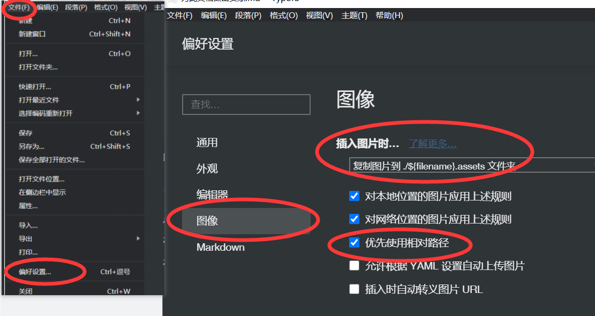

## 一、如何修改该文档内的内容

由于目前文档托管于github，所以需要修改就必须通过github。

我们按修改幅度分成了三种修改方法：**【文字谬误修正】、【内容增添】、【多媒体内容增添】**。分别对应论坛型的文档中的**快速回复、全屏编辑、高级回复**。

| 方法           | 修改范围                             | 难度系数 | 适用情况                                                     |
| -------------- | ------------------------------------ | -------- | ------------------------------------------------------------ |
| 文字谬误修正   | 小幅度修改特定部位文档的错误         | ★★★☆☆    | 只对文字进行修改，无需安装任何额外软件                       |
| 内容增添       | 全范围修改文章                       | ★★★★☆    | 下载回来用专门的编辑器打开，适合大量修改文字，增加外链等。需下载文档本体和git工具（有可视化）用于推送 |
| 多媒体内容增添 | 全方面修改文章、添加图片、视频、脚本 | ★★★★★    | 对于想新增一整个章节的人使用。1.需懂得md语法。2.需安装git工具。3.下载文档至本地。4.对git提交流程需要了解。 |

以上操作方法都会在以下章节一一阐述，请耐心看完。

### 1.1 文字谬误修正

点击右上角的:pencil:图案，就可以对文本内容修改，可以使用[Makrdown语法](https://github.com/younghz/Markdown) 增添内容和修改排版。

在`pull request（后简称PR）`之后，文章管理员会人工审核内容决定是否合并。合并后github会自动上传到托管服务器，等待1-3分钟后刷新浏览器就能看到变化了

**Github推荐默认的修改方法如下：**
1. 开发者 Fork 主仓库到自己账号成为副本仓库
2. 在副本仓库完成代码贡献（添加、删除、修改代码等等）
3. 将副本修改的内容给主仓库提交 PR (Pull Request)
4. 作者审核你提交的代码，并决定是否合并

### 1.2 大范围内容增添

推荐[下载（方法已贴）](https://gitee.com/help/articles/4192#article-header0)本文章全部内容，在本地通过`Typora`、`VS Code`、`Markdown+`等md编辑工具修改内容然后上传到github。因编辑器排版，所见即所得，使用体验良好，本文介绍`Typora`的推荐设置。

插入图片是**选择文件->偏好设置->图像->插入图片时..->复制图片到./${filename}.assets 文件夹->优先使用是相对路径**

并且对网络图片和本地图片都应用上述规则。那么你就可以随心所欲【^C】+【^V】了

!> 对于同一张图片，复制多次进来会出现多张相同图片，如有需要时请通过`markdown`的图片插入语法编写，然后吧多余的图片删除减少阅读时的网络压力。

### 1.3 多媒体内容增添

通过1.2的方法，如果您还不满足，可以对本文档中使用到的技术进行了解。

如果您有意愿加入作为编辑文章的协助者，请联系我们(1209418977@qq.com)

对于拓展语法，请查看以下文档列表，本文中所列拓展语法都可以从此清单查询

**技术插件列表**

- [docsify](https://docsify.js.org/#/zh-cn/) 本文章使用的基础框架搭建，通过对此框架进行修改得来
- [docsify-drawio](https://github.com/KonghaYao/docsify-drawio) 流程图自生成引擎，可通过drawio文件生成流程图
- [docsify-edit-on-github](https://github.com/njleonzhang/docsify-edit-on-github) 在每一页加入去github编辑
- [markdown](https://github.com/younghz/Markdown) 本文章通用语法课程
- [git与github](https://www.runoob.com/w3cnote/git-guide.html) 如何使用github管理文档版本

> 非常感谢所有为本文档提供贡献的小伙伴！

