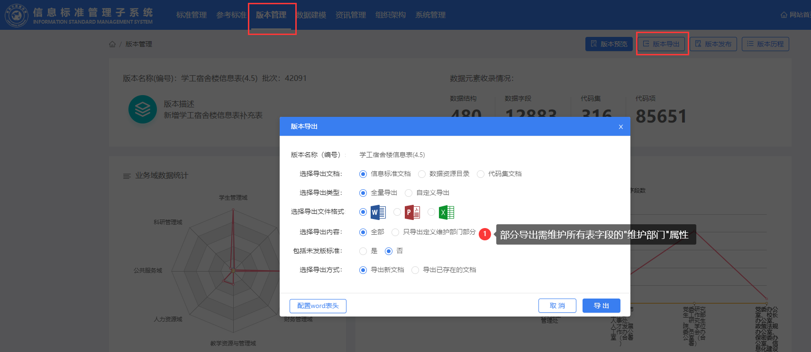

## 一、快速入门

!> 注意： 此部分内容默认了你已阅读过[《第三章节、理论知识篇》](#三、理论知识篇)，在概念、术语上避免了过多的阐述，如果你无法理解本文内容，请回头查询相关知识。

### 1.1 如何制作、导入信息标准？制作信息标准的步骤/流程图

[工作流程图](信息标准平台使用手册.assets/ismpWorkFlowChart.drawio ':include :type=code')

### 1.2 配置信息标准数据源以及创建表权限

首先进入信息标准管理后台，这个界面只有被授权用户（通常是信息系统管理员）才能进入。[如何创建新的信息管理员账户？](#_25-新增管理员)


创建数据源：如果数据源未存在于[数据中心](#数据中心)，选择这个方式创建，创建完后会自动在数据中心中执行创建用户的SQL。

登记数据源：如果之前已经通过手动方式或其他方式创建过数据库用户于[数据中心](#数据中心)，请通过这个方式登记该数据源。

表权限会随着用户的创建自动分配，分配权限的SQL都是通过管理员用户执行，**请确保的管理员用户具有dba权限**。

### 1.3 对照国家标准

#### 获取参考标准文档

我们知道[国家标准](#国家标准)可以从两个地方获取

1. 从网上获取教育局近十年发布的红头文件附件
2. 从信息标准平台的参考标准


#### 找对应标准以进行对照标准

详细步骤请参考[对照标准](#对照标准)篇章

#### 获取代入文档

我们可以通过以下地方获取到的导入文档模板

1. 从导入信息标准的入口处

2. 导出智能db分析平台的分析文档


#### 按要求填写导入文档

此时的按要求尽可能地填入信息标准导入文档，从【DB智能分析平台】获取的文档也是一样。必要填入字段右上角带有红标，每个文档表头会有明确的备注合法填入内容。

这部分工作可以通过智能分析平台完成元数据信息的采集，但是对于部分不规范的数据结构仍需[对照标准](#对照标准)之后才能导入。

!> [代码集](#_34-代码与代码集)部分，如果的与国家标准不相符的，应建立[代码映射](#代码映射)表，在[数据上行](#数据上行)时做一次代码转换

红框部分的B表依赖A表，D表依赖C表，所以请按字母顺序填完这些表单。


#### 推荐的命名规则

由于国家标准没有给出明确的标准类命名规则，于是命名一般由我司自定义。参考标准中的命名过于冗长，推荐按照参考标准表表名中文的首字母拼写作为标准表名称。通过生成出来的表只要确定用户空间即可很明显分出表名：LY_ISJWXT.XSJBSJZL。

```js
/************ 命名规则速查表 *************/
// 不需要添加“表”字。例如：
业务域表注释：学生基本数据子类
业务域表名称：XSJBSJZL

// 如用此法后有重复名称，按照系统在前面加入系统名称以区分。例如：
学工档案信息：XGDAXX
合同档案信息：HTDAXX

// 对于代码表的命名推荐在代码表名加入`DM`后缀以区分代码表和实体表。例如：
学校校区代码：XXXQDM
```

#### 审核与修正

按照要求填入导入文档后，既可以通过该文档导入标准，如有错误，根据提示修正错误再重新导入

!> 请保证留下的信息标准文档是正确的。**导入文档**需要留案作为日后的维护文档。

### 1.4 版本发布与版本控制

#### 控制选项

在版本发布之前，先了解版本控制选项。为实施阶段的方便和流畅，平台增加了版本控制选项，默认开启，如果关闭时能大幅度降低改动时发版的频率，小范围的改动不再需要发版也可以检测出来并物理同步表了。

在实施阶段，我们推荐先关闭版本控制选项，投入使用时再开启。*（路径：系统管理->参数管理->enableVersionControl->否）*


#### 版本发布的方法

在*版本管理->版本发布*，点击后会进入二级菜单，并提示你需要填写部分关于本版本的更新内容信息。


#### 版本预览

点击后会立马生成当前的信息标准文档pdf，通常会持续三十分钟左右时间。下次点击版本预览时可以直接查看生成的pdf文件。

#### 版本导出

此处是已经生成过的信息标准文档、代码集文档等下载位置。

#### 版本历程

在这里可以执行回退到某个版本，查看某个版本的信息标准文档等操作。

#### 版本自检

信息标准平台内置6种标准规则，分别是`非空规则`、`唯一性规则`、`一致性规则`、`规范性规则`、`主键规则`、`自定义规则`。版本自检会根据这6种规则（可配置）检查目前的标准规范程度。

### 1.6 数据建模

#### 引用结构

导入信息标准之后会将标准与数据源关联，这个操作就叫做引用结构。即将数据表分配到各个数据源系统，这里推荐自定义引用，快速引用会将不需要的表也加入物理同步的队列。


#### 物理同步

理论知识章节了解到，[信息标准](#信息标准)导入后只是存在一个模型，该模型是逻辑的，不可以存储数据的。此时我们需要根据已导入标准创建物理表，手动创建实在费时，所以信息标准平台可以通过内置的创建表SQL语句为你创建物理表并授权（在系统设置里可以查看修改创建表语句）。


红色框部分是`数据源管理`菜单中已创建的数据源并通过`引用结构`分配表之后得到的数据源。

可以看到红色框右上角有数据集和代码集，在这里可以决定生成物理表还是代码集。

| 状态     | 结构已引用 | 物理表已存在数据库 | 物理表符合标准   |
| :--------: | ---------- | ------------------ | ---------------- |
| 未核验表   | 是         | 无法确定，需核验   | 无法确定，需核验 |
| 未创建表   | 是         | 否                 | 是               |
| 已创建表   | 是         | 是                 | 是               |
| 不匹配表   | 是         | 是                 | 否               |
| 非标准建表 | 否         | 是                 | 否               |

非标准建表是标准里没有但是数据库里检测出来的，可以通过这个表反向生成一个标准，但生成出来的标准需要逐个填写各项信息，流程更为复杂，本文不推荐反向生成标准。


## 二、维护信息标准

### 2.1 发现已存在的字段标准有错误怎么修正

对于字段（表同理）错误，可以通过其对应的操作区域进行修改操作。


编辑：修改直接列出的属性有错误，能快速修改常见字段错误。

修改：修改该字段的详情属性

### 2.2 怎么导出某版本的信息标准文档、数据资源目录、代码集文档

通过*版本管理->版本导出*处导出信息标准文档、数据资源目录、代码集文档等。

如果想要部分导出，请先确认【维护部门】字段是否不为空，否则找不到对应部门导出，即系统字段必须依赖部门。



### 2.3 从物理表反向建标准？代码表反向同步？这是什么操作

如果所配置的数据源下除了在标准平台中的标准结构外，还有物理表，则在物理同步阶段可以看到有非标准建表，此时可以通过物理表结构反向建标准，也是会在信息管理->导入标准处能看到导入流程。

但是由于的整体操作不如的文档导入方便，所以不建议使用这种方式来导入信息标准。


红圈3处如果选择`代码表`就会在红圈4处看到“代码表反向同步”界面。如果物理代码表数据发生改变，信息标准平台中的代码集是不会产生变化的，此时可以通过该界面反向同步，使得信息标准平台与物理代码表一致。

### 2.4 批量配置使用部门、来源部门

勾选你需要统一修改使用部门、来源部门的的表，通过右上角红框部分的"一键配置"来配置管理属性值


### 2.5 新增管理员

通过在权限平台新增用户，并且授予信息标准平台的管理员权限即可。

## 三、理论知识篇

### 3.1 术语名词解释

#### 信息标准

信息标准指**信息系统的数据结构标准模板**，厂商在开发信息系统时应遵从这份标准进行开发和接入数据。*信息标准符合以下特征：*

- 仅模型：信息标准只是模型，可以构建出物理结构，但本身不是物理结构
- 数据治理平台支撑：是所有数据治理平台的依赖
- 非源头性：信息标准只做搬运工，不生产数据

#### 数据中心

[数据流向示例图](信息标准平台使用手册.assets/ismpDataFlow.drawio ':include :type=code')

数据中心是一个符合[信息标准](#信息标准)的数据库，我们需将厂商数据[对照国家标准](#对照标准)，将源数据不规范的结构打平打整，通过数据交换放置到[数据中心](#数据中心)。

学校会同时存在两份数据：【业务数据】、【数据中心数据】。业务数据永远是安全不受影响的，因为数据治理只会操作到数据中心的数据，无论数据中心数据怎么被破坏，业务数据都不会受到影响。*数据中心符合以下特征：*

- 物理结构集合：不仅符合信息标准模型，还真实存在数据库
- 数据复制性：数据中心会将业务核心数据复制一份，但是表结构不一样
- 不容冗余性：数据中心不是中间库，不符合标准的内容就不能放在数据中心（但可以放在前置库）

!> 由于信息标准平台需要对数据库创建表、创建用户，所以通常情况[数据中心](#数据中心)需要拿到**dba权限**

#### 对照标准

对照标准原指按国家标准规范化数据库，要清楚现实环境不可能要求厂商整改字段结构，通常情况我们不是要去以信息标准要求修改和限制厂商已有信息系统的数据结构，而是对其适配标准，并将拓展成新表接入到符合标准的数据库（即[数据中心](#数据中心)）。

拿到一张表，应判断是否符合[国家标准](#_33-国家标准与行标、校标以及联奕标准)，默认认为如果表的用途和字段与国标表相似度超过70~80%就可以认为这张表是国标表，否则则为校标。

对于符合国家标准的表，我们需要考虑以下三种情况：

- 一对一：该表只跟国标的一张表相似，并且字段相似、用途一致。

- 一对多：该表字段涵盖多张国标表，且字段相似、用途一致，应拆分成多张表对应

- 多对一：有多个表跟的国标表的一张表对应，应组合几张表作为一张国标表（代码表另算）

!> 对于每一行字段，我们应考虑国标是否能容纳存储该数据项的大小，如果无法容纳，则考虑适量增大数据结构的大小。

### 3.2 什么是数据标准平台，用于干什么的，满足学校什么政策要求

#### 设计理念

#### 功能用途

信息标准平台是将我方适配的标准收纳、管理、开放的一个平台，也是数据治理规范化的关键系统。管理已导入的信息标准，内置可供参考的国家标准，为学校的数据表量身制定符合国家发布的标准，集成数据后通过校准每个字段的`类型、长度、置空率`等指标来提高数据质量，可供信息管理人员快速查询字段所在表、代码表等。除此之外，该平台是所有数据治理平台的中心系统，通过读取数据中心的表结构来维护整个数据中心。

### 3.3 国家标准与行标、校标以及联奕标准
|                             标准                             |             更新频度             | 制定方法                                                     |
| :----------------------------------------------------------: | :------------------------------: | ------------------------------------------------------------ |
| 国家标准/教育部标准 | 十年一度，最近一次在2012年发布。 | 由教育部教发厅发布的**《教育管理信息化标准》实施办法**的附件文件制定 |
| 行业标准 |             持续更新             | 经由联奕科技多年的数据治理经验收集的其他同行企业所使用的标准集合。 |
| 学校标准 |             持续更新             | 在学校内正常使用过程中产生的业务数据结构，以及学校客制化需求部分产生的数据结构集合。 |
|                           联奕标准                           |             持续更新             | 以上在我司根据数据治理工作经验的深度融合和根据业务情况改良形成的即联奕标准。 |

### 3.4 代码与代码集、以及代码映射

代码：并非指编制程序执行的代码（programming code），而是指一系列通过编号指代单词的编码。例如`男:1`，`女:2`

代码集：同类代码的集合，例如以上提及的代码例子就属于国标中的**《人的性别代码》**。

代码映射：假如A系统有代码`男:1`、`女:2`，B系统有代码`男:0`，`女:1`，此时AB系统产生了代码冲突，需通过代码映射解决。我们可以使他们共同构成一张表，这张表就叫做代码映射表。此后AB系统可以通过这张表互相得到对方系统的代码项/描述。

| -    | A系统代码项 | A系统代码项描述 | B系统代码项 | B系统代码项描述 |
| ---- | ----------- | --------------- | ----------- | --------------- |
| 行1  | 1           | 男              | 0           | 男              |
| 行2  | 2           | 女              | 1           | 女              |
| 行3  | 9           | 其他            | 3           | 其他            |

### 3.5 业务域与其作用、认识八大域

业务域：分类存放信息标准的文件夹

八大域：信息标准平台会内置8个业务域，分别对应学校常用的几个常用业务场景

### 3.6 物理表与逻辑表的区别

物理表：表结构按照信息标准生成的物理表，可实际存储业务数据。

逻辑表：表结构仅经过规范化处理，在信息标准平台中可查，不可实际存储数据。

信息标准平台在导入标准后不会立即生成物理结构，会存储到`LY_ISMP`下的业务域表记录数据结构，此时还需要通过物理同步生成出的对应物理表，并联合其他平台一起管理这些表。

## 四、常见问题解答 FAQ

### 4.99 未明报错以及处理方式
