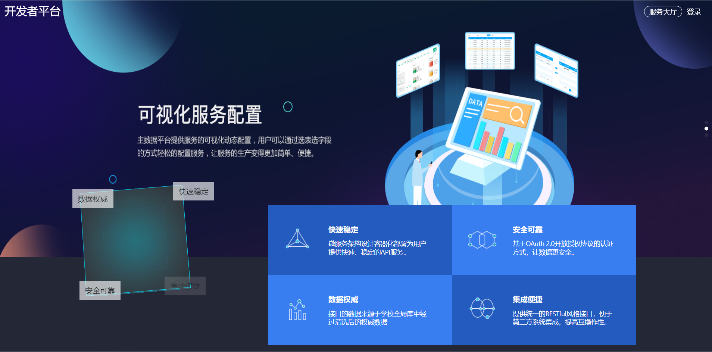
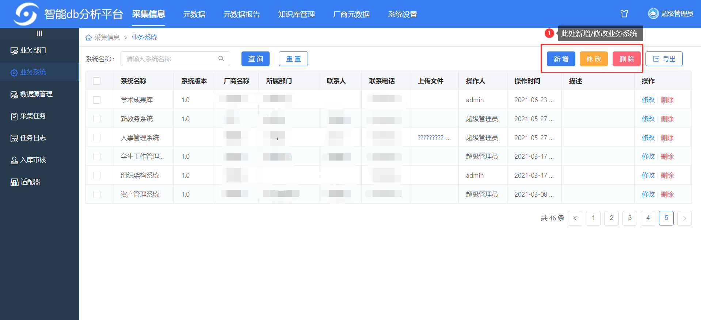
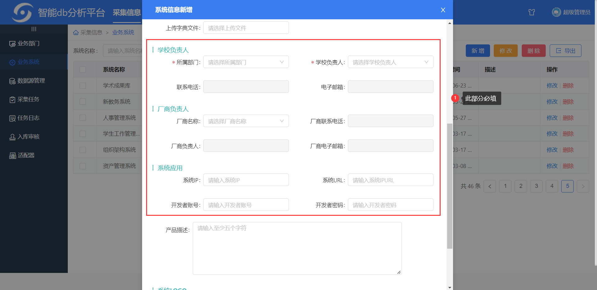
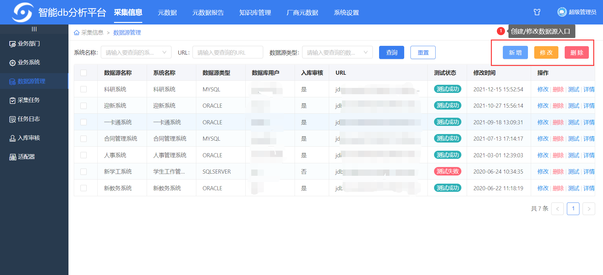
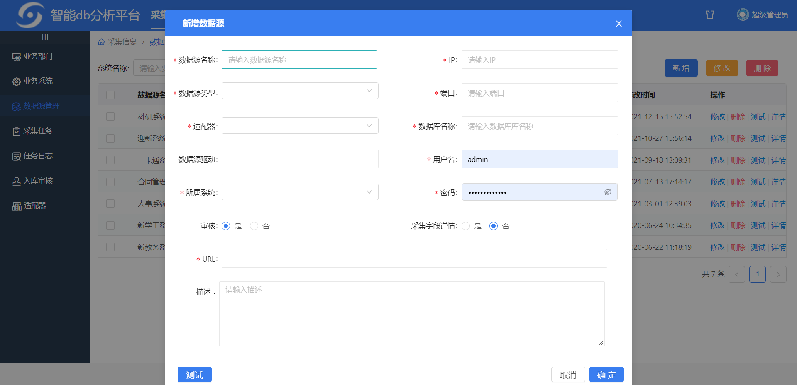

## 一、开发者平台简介

开发者平台是联奕推出的，面向所有需要数据业务系统开发厂商/者获取数据的平台，需要搭配主数据平台使用，通常通过API、文件等方式获取数据，本文主要介绍API获取的方式和操作流程。

## 二、创建API接口流程图

[创建API接口](./开发者平台使用手册.assets/api_flowchart.drawio ':include :type=code')

## 三、操作流程

### 3.1 配置数据源和业务系统

如果已经配置过，那么跳过这一步骤

    
前往智能db分析平台(原元数据平台)配置

#### 配置业务系统

在开发者平台的账号就是在业务系统中配置，此处配置的业务系统负责人邮箱就是在主数据平台发送信息时的接收邮箱。

在`采集信息-业务系统`处右上角可以管理业务系统，每个业务系统一个账号，该账号可以登录到开发者平台获取接口信息。

#### 配置数据源

数据源即提供数据的容器接口，***例如数据库连接，EXCEL文件，API等***，本文以数据库连接为例。

按要求将所有必填项填写，适配器在选择数据源类型选择后出现，根据数据库版本选择对应的适配器即可。

审核字段、采集字段详细是在该平台采集数据库元数据时使用，与本文介绍平台操作无关，任意选择。

### 3.2 主数据平台

